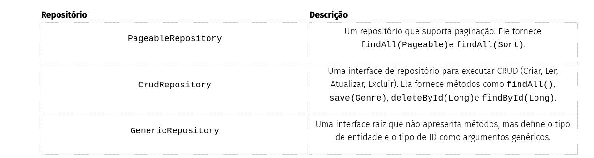

# Data JDBC

## [Access a database with Micronaut Data JDBC](https://guides.micronaut.io/latest/micronaut-data-jdbc-repository-maven-java.html)

O aplicativo expõe alguns endpoints REST e armazena dados em um banco de dados MySQL usando o Micronaut Data JDBC.


### Configuração do banco de dados

```yaml
datasources:
  default:
	dialect: MYSQL
	driver-class-name: com.mysql.cj.jdbc.Driver
	url: jdbc:mysql://localhost:3306/micronaut
	username: root
	password: root
```

```xml
<dependency>
    <groupId>io.micronaut.flyway</groupId>
    <artifactId>micronaut-flyway</artifactId>
    <scope>compile</scope>
</dependency>

```


```yml
flyway:
  datasources:
	default:
	  enabled: true
	  locations: classpath:db/migration
```


```sql
-- src/main/resources/db/migration/V1__create_person_table.sql
DROP TABLE IF EXISTS genre;

CREATE TABLE genre (
    id   BIGINT NOT NULL AUTO_INCREMENT UNIQUE PRIMARY KEY,
   name  VARCHAR(255) NOT NULL UNIQUE
);
```

### Entidade

```java
package example.micronaut.domain;

import io.micronaut.data.annotation.GeneratedValue;
import io.micronaut.data.annotation.Id;
import io.micronaut.data.annotation.MappedEntity;
import io.micronaut.serde.annotation.Serdeable;

import jakarta.validation.constraints.NotNull;

@Serdeable
@MappedEntity
public class Genre {

    @Id
    @GeneratedValue(GeneratedValue.Type.AUTO)
    private Long id;

    @NotNull
    private String name;

    public Long getId() {
        return id;
    }

    public void setId(Long id) {
        this.id = id;
    }

    public String getName() {
        return name;
    }

    public void setName(String name) {
        this.name = name;
    }

    @Override
    public String toString() {
        return "Genre{" +
                "id=" + id +
                ", name='" + name + '\'' +
                '}';
    }
}

```

### Repositório

```java
package example.micronaut;

import example.micronaut.domain.Genre;
import io.micronaut.core.annotation.NonNull;
import io.micronaut.data.annotation.Id;
import io.micronaut.data.exceptions.DataAccessException;
import io.micronaut.data.jdbc.annotation.JdbcRepository;
import io.micronaut.data.model.query.builder.sql.Dialect;
import io.micronaut.data.repository.PageableRepository;

import jakarta.transaction.Transactional;
import jakarta.validation.constraints.NotBlank;
import jakarta.validation.constraints.NotNull;

@JdbcRepository(dialect = Dialect.MYSQL)
public interface GenreRepository extends PageableRepository<Genre, Long> {

    Genre save(@NonNull @NotBlank String name);

    @Transactional
    default Genre saveWithException(@NonNull @NotBlank String name) {
        save(name);
        throw new DataAccessException("test exception");
    }

    long update(@NonNull @NotNull @Id Long id, @NonNull @NotBlank String name);
}
```




### Controlador

A validação do Micronaut é baseada na estrutura padrão JSR 380 , também conhecida como Validação de Beans 2.0. A Validação do Micronaut possui suporte integrado para validação de beans anotados com jakarta.validationanotações.

Para usar o Micronaut Validation, você precisa das seguintes dependências:

```xml
<!-- Add the following to your annotationProcessorPaths element -->
<path>
    <groupId>io.micronaut.validation</groupId>
    <artifactId>micronaut-validation-processor</artifactId>
</path>
<dependency>
    <groupId>io.micronaut.validation</groupId>
    <artifactId>micronaut-validation</artifactId>
    <scope>compile</scope>
</dependency>

```

```java

package example.micronaut;

import io.micronaut.serde.annotation.Serdeable;

import jakarta.validation.constraints.NotBlank;
import jakarta.validation.constraints.NotNull;

@Serdeable
public class GenreUpdateCommand {
    @NotNull
    private final Long id;

    @NotBlank
    private final String name;

    public GenreUpdateCommand(Long id, String name) {
        this.id = id;
        this.name = name;
    }

    public Long getId() {
        return id;
    }

    public String getName() {
        return name;
    }

}

```

#### Controlador

```java

package example.micronaut;

import example.micronaut.domain.Genre;
import io.micronaut.data.exceptions.DataAccessException;
import io.micronaut.data.model.Pageable;
import io.micronaut.http.HttpHeaders;
import io.micronaut.http.HttpResponse;
import io.micronaut.http.HttpStatus;
import io.micronaut.http.annotation.Body;
import io.micronaut.http.annotation.Controller;
import io.micronaut.http.annotation.Delete;
import io.micronaut.http.annotation.Get;
import io.micronaut.http.annotation.Post;
import io.micronaut.http.annotation.Put;
import io.micronaut.http.annotation.Status;
import io.micronaut.scheduling.TaskExecutors;
import io.micronaut.scheduling.annotation.ExecuteOn;

import jakarta.validation.Valid;
import jakarta.validation.constraints.NotBlank;
import java.net.URI;
import java.util.List;
import java.util.Optional;

@ExecuteOn(TaskExecutors.BLOCKING)
@Controller("/genres")
public class GenreController {

    protected final GenreRepository genreRepository;

    public GenreController(GenreRepository genreRepository) {
        this.genreRepository = genreRepository;
    }

    @Get("/{id}")
    public Optional<Genre> show(Long id) {
        return genreRepository
                .findById(id);
    }

    @Put
    public HttpResponse update(@Body @Valid GenreUpdateCommand command) {
        genreRepository.update(command.getId(), command.getName());
        return HttpResponse
                .noContent()
                .header(HttpHeaders.LOCATION, location(command.getId()).getPath());
    }

    @Get("/list")
    public List<Genre> list(@Valid Pageable pageable) {
        return genreRepository.findAll(pageable).getContent();
    }

    @Post
    public HttpResponse<Genre> save(@Body("name") @NotBlank String name) {
        Genre genre = genreRepository.save(name);

        return HttpResponse
                .created(genre)
                .headers(headers -> headers.location(location(genre.getId())));
    }

    @Post("/ex")
    public HttpResponse<Genre> saveExceptions(@Body @NotBlank String name) {
        try {
            Genre genre = genreRepository.saveWithException(name);
            return HttpResponse
                    .created(genre)
                    .headers(headers -> headers.location(location(genre.getId())));
        } catch(DataAccessException e) {
            return HttpResponse.noContent();
        }
    }

    @Delete("/{id}")
    @Status(HttpStatus.NO_CONTENT)
    public void delete(Long id) {
        genreRepository.deleteById(id);
    }

    protected URI location(Long id) {
        return URI.create("/genres/" + id);
    }

    protected URI location(Genre genre) {
        return location(genre.getId());
    }
}

```

1. **É essencial que quaisquer operações de E/S de bloqueio** (como buscar dados do banco de dados) sejam descarregadas para um pool de threads separado que não bloqueie o loop de eventos.

2. **A classe é definida como um controlador** com a anotação [@Controller](https://docs.micronaut.io/latest/api/io/micronaut/http/annotation/Controller.html) mapeada para o caminho `/genres`.

3. **Use injeção de construtor** para injetar um bean do tipo `GenreRepository`.

4. **Mapeia uma `GET` solicitação para `/genres/{id}`**, que tenta mostrar um gênero. Isso ilustra o uso de uma variável de caminho de URL.

5. **Retornar um opcional vazio** quando o gênero não existe faz com que o framework Micronaut responda com 404 (não encontrado).

6. **Mapeia uma `PUT` solicitação para `/genres`**, que tenta atualizar um gênero.

7. **Adiciona `@Valid`** a qualquer parâmetro do método que requeira validação. Use um POJO fornecido como carga JSON na solicitação para preencher o comando.

8. **É fácil adicionar cabeçalhos personalizados** à resposta.

9. **Mapeia uma `GET` solicitação para `/genres/list`**, que retorna uma lista de gêneros. Este mapeamento ilustra parâmetros de URL sendo mapeados para um único POJO.

10. **Você pode vincular `Pageable`** como um argumento de método do controlador. Confira os exemplos na seção de testes a seguir e leia as opções [de configuração do Pageable](https://micronaut-projects.github.io/micronaut-data/latest/guide/configurationreference.html#io.micronaut.data.runtime.config.DataConfiguration.PageableConfiguration). Por exemplo, você pode configurar o tamanho padrão da página com a propriedade de configuração `micronaut.data.pageable.default-page-size`.

11. **Mapeia uma `POST` solicitação para `/genres`**, que tenta salvar um gênero.

12. **Mapeia uma `POST` solicitação para `/ex`**, o que gera uma exceção.

13. **Mapeia uma `DELETE` solicitação para `/genres/{id}`**, que tenta remover um gênero. Isso ilustra o uso de uma variável de caminho de URL.


### Testes

```java
package example.micronaut;

import example.micronaut.domain.Genre;
import io.micronaut.core.type.Argument;
import io.micronaut.http.HttpHeaders;
import io.micronaut.http.HttpRequest;
import io.micronaut.http.HttpResponse;
import io.micronaut.http.HttpStatus;
import io.micronaut.http.client.HttpClient;
import io.micronaut.http.client.annotation.Client;
import io.micronaut.http.client.exceptions.HttpClientResponseException;
import io.micronaut.test.extensions.junit5.annotation.MicronautTest;
import jakarta.inject.Inject;
import org.junit.jupiter.api.Test;

import java.util.ArrayList;
import java.util.Collections;
import java.util.List;

import static org.junit.jupiter.api.Assertions.assertEquals;
import static org.junit.jupiter.api.Assertions.assertNotNull;
import static org.junit.jupiter.api.Assertions.assertThrows;

@MicronautTest
public class GenreControllerTest {

    @Inject
    @Client("/")
    HttpClient client;

    @Test
    public void testFindNonExistingGenreReturns404() {
        HttpClientResponseException thrown = assertThrows(HttpClientResponseException.class, () -> {
            client.toBlocking().exchange(HttpRequest.GET("/genres/99"));
        });

        assertNotNull(thrown.getResponse());
        assertEquals(HttpStatus.NOT_FOUND, thrown.getStatus());
    }

    @Test
    public void testGenreCrudOperations() {

        List<Long> genreIds = new ArrayList<>();

        HttpRequest<?> request = HttpRequest.POST("/genres", Collections.singletonMap("name", "DevOps"));
        HttpResponse<?> response = client.toBlocking().exchange(request);
        genreIds.add(entityId(response));

        assertEquals(HttpStatus.CREATED, response.getStatus());

        request = HttpRequest.POST("/genres", Collections.singletonMap("name", "Microservices"));
        response = client.toBlocking().exchange(request);

        assertEquals(HttpStatus.CREATED, response.getStatus());

        Long id = entityId(response);
        genreIds.add(id);
        request = HttpRequest.GET("/genres/" + id);

        Genre genre = client.toBlocking().retrieve(request, Genre.class);

        assertEquals("Microservices", genre.getName());

        request = HttpRequest.PUT("/genres", new GenreUpdateCommand(id, "Micro-services"));
        response = client.toBlocking().exchange(request);

        assertEquals(HttpStatus.NO_CONTENT, response.getStatus());

        request = HttpRequest.GET("/genres/" + id);
        genre = client.toBlocking().retrieve(request, Genre.class);
        assertEquals("Micro-services", genre.getName());

        request = HttpRequest.GET("/genres/list");
        List<Genre> genres = client.toBlocking().retrieve(request, Argument.of(List.class, Genre.class));

        assertEquals(2, genres.size());

        request = HttpRequest.POST("/genres/ex", Collections.singletonMap("name", "Microservices"));
        response = client.toBlocking().exchange(request);

        assertEquals(HttpStatus.NO_CONTENT, response.getStatus());

        request = HttpRequest.GET("/genres/list");
        genres = client.toBlocking().retrieve(request, Argument.of(List.class, Genre.class));

        assertEquals(2, genres.size());

        request = HttpRequest.GET("/genres/list?size=1");
        genres = client.toBlocking().retrieve(request, Argument.of(List.class, Genre.class));

        assertEquals(1, genres.size());
        assertEquals("DevOps", genres.get(0).getName());

        request = HttpRequest.GET("/genres/list?size=1&sort=name,desc");
        genres = client.toBlocking().retrieve(request, Argument.of(List.class, Genre.class));

        assertEquals(1, genres.size());
        assertEquals("Micro-services", genres.get(0).getName());

        request = HttpRequest.GET("/genres/list?size=1&page=2");
        genres = client.toBlocking().retrieve(request, Argument.of(List.class, Genre.class));

        assertEquals(0, genres.size());

        // cleanup:
        for (Long genreId : genreIds) {
            request = HttpRequest.DELETE("/genres/" + genreId);
            response = client.toBlocking().exchange(request);
            assertEquals(HttpStatus.NO_CONTENT, response.getStatus());
        }
    }

    protected Long entityId(HttpResponse<?> response) {
        String path = "/genres/";
        String value = response.header(HttpHeaders.LOCATION);
        if (value == null) {
            return null;
        }
        int index = value.indexOf(path);
        if (index != -1) {
            return Long.valueOf(value.substring(index + path.length()));
        }
        return null;
    }
}
