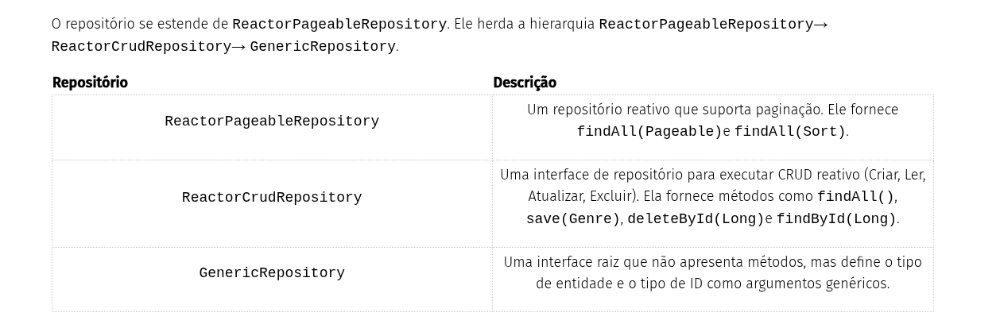

# Data jpa

## [Jpa e hibernate](https://guides.micronaut.io/latest/micronaut-jpa-hibernate-maven-java.html)

Neste guia, escreveremos um aplicativo Micronaut que expõe alguns endpoints REST e armazena dados em um banco de dados usando JPA e Hibernate.

```xml

<dependency>
    <groupId>io.micronaut.sql</groupId>
    <artifactId>micronaut-hibernate-jpa</artifactId>
    <scope>compile</scope>
</dependency>
<dependency>
    <groupId>io.micronaut.data</groupId>
    <artifactId>micronaut-data-tx-hibernate</artifactId>
    <scope>compile</scope>
</dependency>
<dependency>
    <groupId>io.micronaut.sql</groupId>
    <artifactId>micronaut-jdbc-hikari</artifactId>
    <scope>compile</scope>
</dependency>
<dependency>
    <groupId>com.h2database</groupId>
    <artifactId>h2</artifactId>
    <scope>runtime</scope>
</dependency>

```

1. Configura beans Hibernate/JPA EntityManagerFactory.
2. Adiciona dependência do Hibernate para transações de dados do Micronaut.
3. Configura instâncias do SQL DataSource usando o Hikari Connection Pool.
4. Adicione dependência ao banco de dados H2 na memória.

### Configuração do banco de dados

```yml

datasources:
  default:
	url: jdbc:h2:mem:default;DB_CLOSE_DELAY=-1;DB_CLOSE_ON_EXIT=FALSE
	driver-class-name: org.h2.Driver
	username: sa
	password: ""
	dialect: H2
	schema-generate: CREATE_DROP
	default-schema: PUBLIC

	jpa:
	  default:
	    properties:
	      hibernate:
	        hbm2ddl:
	          auto: update
	        show_sql: true


```


### Dominio

```java

package example.micronaut.domain;

import com.fasterxml.jackson.annotation.JsonIgnore;

import io.micronaut.serde.annotation.Serdeable;

import jakarta.persistence.Column;
import jakarta.persistence.Entity;
import jakarta.persistence.GeneratedValue;
import jakarta.persistence.Id;
import jakarta.persistence.OneToMany;
import jakarta.persistence.Table;
import jakarta.validation.constraints.NotNull;
import java.util.HashSet;
import java.util.Set;

import static jakarta.persistence.GenerationType.AUTO;

@Serdeable
@Entity
@Table(name = "genre")
public class Genre {

    @Id
    @GeneratedValue(strategy = AUTO)
    private Long id;

    @NotNull
    @Column(name = "name", nullable = false, unique = true)
    private String name;

    @JsonIgnore
    @OneToMany(mappedBy = "genre")
    private Set<Book> books = new HashSet<>();

    public Genre() {}

    public Genre(@NotNull String name) {
        this.name = name;
    }

    public Long getId() {
        return id;
    }

    public void setId(Long id) {
        this.id = id;
    }

    public String getName() {
        return name;
    }

    public void setName(String name) {
        this.name = name;
    }

    public Set<Book> getBooks() {
        return books;
    }

    public void setBooks(Set<Book> books) {
        this.books = books;
    }

    @Override
    public String toString() {
        return "Genre{" +
            "id=" + id +
            ", name='" + name + '\'' +
            '}';
    }
}

package example.micronaut.domain;

import io.micronaut.serde.annotation.Serdeable;

import jakarta.persistence.Column;
import jakarta.persistence.Entity;
import jakarta.persistence.GeneratedValue;
import jakarta.persistence.Id;
import jakarta.persistence.ManyToOne;
import jakarta.persistence.Table;
import jakarta.validation.constraints.NotNull;

import static jakarta.persistence.GenerationType.AUTO;

@Serdeable
@Entity
@Table(name = "book")
public class Book {

    @Id
    @GeneratedValue(strategy = AUTO)
    private Long id;

    @NotNull
    @Column(name = "name", nullable = false)
    private String name;

    @NotNull
    @Column(name = "isbn", nullable = false)
    private String isbn;

    @ManyToOne
    private Genre genre;

    public Book() {}

    public Book(@NotNull String isbn,
                @NotNull String name,
                Genre genre) {
        this.isbn = isbn;
        this.name = name;
        this.genre = genre;
    }

    public Long getId() {
        return id;
    }

    public void setId(Long id) {
        this.id = id;
    }

    public String getName() {
        return name;
    }

    public void setName(String name) {
        this.name = name;
    }

    public String getIsbn() {
        return isbn;
    }

    public void setIsbn(String isbn) {
        this.isbn = isbn;
    }

    public Genre getGenre() {
        return genre;
    }

    public void setGenre(Genre genre) {
        this.genre = genre;
    }

    @Override
    public String toString() {
        return "Book{" +
                "id=" + id +
                ", name='" + name + '\'' +
                ", isbn='" + isbn + '\'' +
                ", genre=" + genre +
                '}';
    }
}


```

### Validação

```xml

<!-- Add the following to your annotationProcessorPaths element -->
<path>
    <groupId>io.micronaut.validation</groupId>
    <artifactId>micronaut-validation-processor</artifactId>
</path>
<dependency>
    <groupId>io.micronaut.validation</groupId>
    <artifactId>micronaut-validation</artifactId>
    <scope>compile</scope>
</dependency>

```


### Repositório

```java
package example.micronaut;

import example.micronaut.domain.Genre;

import jakarta.validation.constraints.NotBlank;
import jakarta.validation.constraints.NotNull;
import java.util.List;
import java.util.Optional;

public interface GenreRepository {

    Optional<Genre> findById(long id);

    Genre save(@NotBlank String name);

    Genre saveWithException(@NotBlank String name);

    void deleteById(long id);

    List<Genre> findAll(@NotNull SortingAndOrderArguments args);

    int update(long id, @NotBlank String name);
}


package example.micronaut;

import example.micronaut.domain.Genre;
import io.micronaut.transaction.annotation.ReadOnly;
import io.micronaut.transaction.annotation.Transactional;
import jakarta.inject.Singleton;

import jakarta.persistence.EntityManager;
import jakarta.persistence.PersistenceException;
import jakarta.persistence.TypedQuery;
import jakarta.validation.constraints.NotBlank;
import jakarta.validation.constraints.NotNull;
import java.util.Arrays;
import java.util.List;
import java.util.Optional;

@Singleton
public class GenreRepositoryImpl implements GenreRepository {

    private static final List<String> VALID_PROPERTY_NAMES = Arrays.asList("id", "name");

    private final EntityManager entityManager;
    private final ApplicationConfiguration applicationConfiguration;

    public GenreRepositoryImpl(EntityManager entityManager,
                               ApplicationConfiguration applicationConfiguration) {
        this.entityManager = entityManager;
        this.applicationConfiguration = applicationConfiguration;
    }

    @Override
    @ReadOnly
    public Optional<Genre> findById(long id) {
        return Optional.ofNullable(entityManager.find(Genre.class, id));
    }

    @Override
    @Transactional
    public Genre save(@NotBlank String name) {
        Genre genre = new Genre(name);
        entityManager.persist(genre);
        return genre;
    }

    @Override
    @Transactional
    public void deleteById(long id) {
        findById(id).ifPresent(entityManager::remove);
    }

    @ReadOnly
    public List<Genre> findAll(@NotNull SortingAndOrderArguments args) {
        String qlString = "SELECT g FROM Genre as g";
        if (args.order() != null && args.sort() != null && VALID_PROPERTY_NAMES.contains(args.sort())) {
            qlString += " ORDER BY g." + args.sort() + ' ' + args.order().toLowerCase();
        }
        TypedQuery<Genre> query = entityManager.createQuery(qlString, Genre.class);
        query.setMaxResults(args.max() != null ? args.max() : applicationConfiguration.getMax());
        if (args.offset() != null) {
            query.setFirstResult(args.offset());
        }
        return query.getResultList();
    }

    @Override
    @Transactional
    public int update(long id, @NotBlank String name) {
        return entityManager.createQuery("UPDATE Genre g SET name = :name where id = :id")
                .setParameter("name", name)
                .setParameter("id", id)
                .executeUpdate();
    }

    @Override
    @Transactional
    public Genre saveWithException(@NotBlank String name) {
        save(name);
        throw new PersistenceException();
    }
}

```

### Controller

Crie duas classes para encapsular as operações Salvar e Atualizar:

```java

package example.micronaut;

import io.micronaut.serde.annotation.Serdeable;

import jakarta.validation.constraints.NotBlank;

@Serdeable
public class GenreSaveCommand {

    @NotBlank
    private String name;

    public GenreSaveCommand(String name) {
        this.name = name;
    }

    public String getName() {
        return name;
    }

    public void setName(String name) {
        this.name = name;
    }
}

package example.micronaut;

import io.micronaut.serde.annotation.Serdeable;

import jakarta.validation.constraints.NotBlank;

@Serdeable
public class GenreUpdateCommand {

    private long id;

    @NotBlank
    private String name;

    public GenreUpdateCommand(long id, String name) {
        this.id = id;
        this.name = name;
    }

    public long getId() {
        return id;
    }

    public void setId(long id) {
        this.id = id;
    }

    public String getName() {
        return name;
    }

    public void setName(String name) {
        this.name = name;
    }
}

package example.micronaut;

import io.micronaut.core.annotation.Nullable;
import io.micronaut.serde.annotation.Serdeable;

import jakarta.validation.constraints.Pattern;
import jakarta.validation.constraints.Positive;
import jakarta.validation.constraints.PositiveOrZero;

@Serdeable
public record SortingAndOrderArguments(
        @Nullable
        @PositiveOrZero
        Integer offset,

        @Nullable
        @Positive
        Integer max,

         @Nullable
         @Pattern(regexp = "id|name")
         String sort,

         @Nullable
        @Pattern(regexp = "asc|ASC|desc|DESC")
        String order
) {

}

```


```java
package example.micronaut;

import example.micronaut.domain.Genre;
import io.micronaut.http.HttpResponse;
import io.micronaut.http.annotation.Body;
import io.micronaut.http.annotation.Controller;
import io.micronaut.http.annotation.Delete;
import io.micronaut.http.annotation.Get;
import io.micronaut.http.annotation.Post;
import io.micronaut.http.annotation.Put;
import io.micronaut.scheduling.TaskExecutors;
import io.micronaut.scheduling.annotation.ExecuteOn;

import jakarta.persistence.PersistenceException;
import jakarta.validation.Valid;
import java.net.URI;
import java.util.List;

import static io.micronaut.http.HttpHeaders.LOCATION;

@ExecuteOn(TaskExecutors.BLOCKING)
@Controller("/genres")
class GenreController {

    private final GenreRepository genreRepository;

    GenreController(GenreRepository genreRepository) {
        this.genreRepository = genreRepository;
    }

    @Get("/{id}")
    Genre show(Long id) {
        return genreRepository
                .findById(id)
                .orElse(null);
    }

    @Put
    HttpResponse<?> update(@Body @Valid GenreUpdateCommand command) {
        int numberOfEntitiesUpdated = genreRepository.update(command.getId(), command.getName());

        return HttpResponse
                .noContent()
                .header(LOCATION, location(command.getId()).getPath());
    }

    @Get(value = "/list{?args*}")
    List<Genre> list(@Valid SortingAndOrderArguments args) {
        return genreRepository.findAll(args);
    }

    @Post
    HttpResponse<Genre> save(@Body @Valid GenreSaveCommand cmd) {
        Genre genre = genreRepository.save(cmd.getName());

        return HttpResponse
                .created(genre)
                .headers(headers -> headers.location(location(genre.getId())));
    }

    @Post("/ex")
    HttpResponse<Genre> saveExceptions(@Body @Valid GenreSaveCommand cmd) {
        try {
            Genre genre = genreRepository.saveWithException(cmd.getName());
            return HttpResponse
                    .created(genre)
                    .headers(headers -> headers.location(location(genre.getId())));
        } catch(PersistenceException e) {
            return HttpResponse.noContent();
        }
    }

    @Delete("/{id}")
    HttpResponse<?> delete(Long id) {
        genreRepository.deleteById(id);
        return HttpResponse.noContent();
    }

    private URI location(Long id) {
        return URI.create("/genres/" + id);
    }
}
```

```java

package example.micronaut;

import example.micronaut.domain.Genre;
import io.micronaut.core.type.Argument;
import io.micronaut.http.HttpRequest;
import io.micronaut.http.HttpResponse;
import io.micronaut.http.client.BlockingHttpClient;
import io.micronaut.http.client.HttpClient;
import io.micronaut.http.client.annotation.Client;
import io.micronaut.http.client.exceptions.HttpClientResponseException;
import io.micronaut.test.extensions.junit5.annotation.MicronautTest;
import jakarta.inject.Inject;
import org.junit.jupiter.api.BeforeEach;
import org.junit.jupiter.api.Test;

import java.util.ArrayList;
import java.util.List;

import static io.micronaut.http.HttpHeaders.LOCATION;
import static io.micronaut.http.HttpStatus.BAD_REQUEST;
import static io.micronaut.http.HttpStatus.CREATED;
import static io.micronaut.http.HttpStatus.NOT_FOUND;
import static io.micronaut.http.HttpStatus.NO_CONTENT;
import static org.junit.jupiter.api.Assertions.assertEquals;
import static org.junit.jupiter.api.Assertions.assertNotNull;
import static org.junit.jupiter.api.Assertions.assertThrows;

@MicronautTest
class GenreControllerTest {

    private BlockingHttpClient blockingClient;

    @Inject
    @Client("/")
    HttpClient client;

    @BeforeEach
    void setup() {
        blockingClient = client.toBlocking();
    }

    @Test
    void supplyAnInvalidOrderTriggersValidationFailure() {
        HttpClientResponseException thrown = assertThrows(HttpClientResponseException.class, () ->
                blockingClient.exchange(HttpRequest.GET("/genres/list?order=foo"))
        );

        assertNotNull(thrown.getResponse());
        assertEquals(BAD_REQUEST, thrown.getStatus());
    }

    @Test
    void testFindNonExistingGenreReturns404() {
        HttpClientResponseException thrown = assertThrows(HttpClientResponseException.class, () ->
            blockingClient.exchange(HttpRequest.GET("/genres/99"))
        );

        assertNotNull(thrown.getResponse());
        assertEquals(NOT_FOUND, thrown.getStatus());
    }

    @Test
    void testGenreCrudOperations() {

        List<Long> genreIds = new ArrayList<>();

        HttpRequest<?> request = HttpRequest.POST("/genres", new GenreSaveCommand("DevOps"));
        HttpResponse<?> response = blockingClient.exchange(request);
        genreIds.add(entityId(response));

        assertEquals(CREATED, response.getStatus());

        request = HttpRequest.POST("/genres", new GenreSaveCommand("Microservices"));
        response = blockingClient.exchange(request);

        assertEquals(CREATED, response.getStatus());

        Long id = entityId(response);
        genreIds.add(id);
        request = HttpRequest.GET("/genres/" + id);

        Genre genre = blockingClient.retrieve(request, Genre.class);

        assertEquals("Microservices", genre.getName());

        request = HttpRequest.PUT("/genres", new GenreUpdateCommand(id, "Micro-services"));
        response = blockingClient.exchange(request);

        assertEquals(NO_CONTENT, response.getStatus());

        request = HttpRequest.GET("/genres/" + id);
        genre = blockingClient.retrieve(request, Genre.class);
        assertEquals("Micro-services", genre.getName());

        request = HttpRequest.GET("/genres/list");
        List<Genre> genres = blockingClient.retrieve(request, Argument.of(List.class, Genre.class));

        assertEquals(2, genres.size());

        request = HttpRequest.POST("/genres/ex", new GenreSaveCommand("Microservices"));
        response = blockingClient.exchange(request);

        assertEquals(NO_CONTENT, response.getStatus());

        request = HttpRequest.GET("/genres/list");
        genres = blockingClient.retrieve(request, Argument.of(List.class, Genre.class));

        assertEquals(2, genres.size());

        request = HttpRequest.GET("/genres/list?max=1");
        genres = blockingClient.retrieve(request, Argument.of(List.class, Genre.class));

        assertEquals(1, genres.size());
        assertEquals("DevOps", genres.get(0).getName());

        request = HttpRequest.GET("/genres/list?max=1&order=desc&sort=name");
        genres = blockingClient.retrieve(request, Argument.of(List.class, Genre.class));

        assertEquals(1, genres.size());
        assertEquals("Micro-services", genres.get(0).getName());

        request = HttpRequest.GET("/genres/list?max=1&offset=10");
        genres = blockingClient.retrieve(request, Argument.of(List.class, Genre.class));

        assertEquals(0, genres.size());

        // cleanup:
        for (Long genreId : genreIds) {
            request = HttpRequest.DELETE("/genres/" + genreId);
            response = blockingClient.exchange(request);
            assertEquals(NO_CONTENT, response.getStatus());
        }
    }

    private Long entityId(HttpResponse response) {
        String path = "/genres/";
        String value = response.header(LOCATION);
        if (value == null) {
            return null;
        }

        int index = value.indexOf(path);
        if (index != -1) {
            return Long.valueOf(value.substring(index + path.length()));
        }

        return null;
    }
}

```

## [Access a database with Micronaut Data and Hibernate Reactive](https://guides.micronaut.io/latest/micronaut-data-hibernate-reactive-gradle-java.html)

Neste guia, criaremos um aplicativo Micronaut escrito em Java.

Neste guia, escreveremos um aplicativo Micronaut que expõe alguns endpoints REST e armazena dados em um banco de dados usando JPA e Hibernate.

implementation("io.micronaut.data:micronaut-data-hibernate-reactive")
implementation("io.vertx:vertx-mysql-client")

```xml
<dependency>
	<groupId>io.micronaut.data</groupId>
	<artifactId>micronaut-data-hibernate-reactive</artifactId>
	<scope>compile</scope>
</dependency>

<dependency>
	<groupId>io.vertx</groupId>
	<artifactId>vertx-mysql-client</artifactId>
	<scope>compile</scope>
</dependency>
```


```yml

jpa:
  default:
    entity-scan:
      packages:
        - 'example.micronaut.domain'
    properties:
      hibernate:
        show-sql: true
        hbm2ddl:
          auto: update
        connection:
          db-type: mysql
    reactive: true

```

1. Configure o pacote que contém nossas classes de entidade.
2. Configure como o Hibernate gerenciará o banco de dados.
3. Configurar o tipo de banco de dados para recursos de teste

### Domínio

```java
package example.micronaut.domain;

import io.micronaut.serde.annotation.Serdeable;
import jakarta.persistence.GenerationType;
import jakarta.validation.constraints.NotNull;
import jakarta.persistence.Column;
import jakarta.persistence.Convert;
import jakarta.persistence.Entity;
import jakarta.persistence.GeneratedValue;
import jakarta.persistence.Id;

@Serdeable
@Entity
public class Genre {

    @Id
    @GeneratedValue(strategy = GenerationType.IDENTITY)
    private Long id;

    @NotNull
    private String name;

    public Long getId() {
        return id;
    }

    public void setId(Long id) {
        this.id = id;
    }

    public String getName() {
        return name;
    }

    public void setName(String name) {
        this.name = name;
    }

    @Override
    public String toString() {
        return "Genre{" +
                "id=" + id +
                ", name='" + name + '\'' +
                '}';
    }
}
```

### Acesso ao banco de dados

```java
package example.micronaut;

import example.micronaut.domain.Genre;
import io.micronaut.core.annotation.NonNull;
import io.micronaut.data.annotation.Id;
import io.micronaut.data.annotation.Repository;
import io.micronaut.data.exceptions.DataAccessException;
import io.micronaut.data.repository.reactive.ReactorPageableRepository;
import reactor.core.publisher.Mono;

import jakarta.transaction.Transactional;
import jakarta.validation.constraints.NotBlank;
import jakarta.validation.constraints.NotNull;

@Repository
public interface GenreRepository extends ReactorPageableRepository<Genre, Long> {

    Mono<Genre> save(@NonNull @NotBlank String name);

    @Transactional
    default Mono<Genre> saveWithException(@NonNull @NotBlank String name) {
        return save(name)
                .handle((genre, sink) -> {
                    sink.error(new DataAccessException("test exception"));
                });
    }

    Mono<Long> update(@NonNull @NotNull @Id Long id, @NonNull @NotBlank String name);
}

```



### Controlador


```java

package example.micronaut;

import io.micronaut.serde.annotation.Serdeable;

import jakarta.validation.constraints.NotBlank;
import jakarta.validation.constraints.NotNull;

@Serdeable
public class GenreUpdateCommand {

    @NotNull
    private final Long id;

    @NotBlank
    private final String name;

    public GenreUpdateCommand(Long id, String name) {
        this.id = id;
        this.name = name;
    }

    public Long getId() {
        return id;
    }

    public String getName() {
        return name;
    }

	package example.micronaut;

import example.micronaut.domain.Genre;
import io.micronaut.data.exceptions.DataAccessException;
import io.micronaut.data.model.Page;
import io.micronaut.data.model.Pageable;
import io.micronaut.http.HttpHeaders;
import io.micronaut.http.HttpResponse;
import io.micronaut.http.MutableHttpResponse;
import io.micronaut.http.annotation.Body;
import io.micronaut.http.annotation.Controller;
import io.micronaut.http.annotation.Delete;
import io.micronaut.http.annotation.Get;
import io.micronaut.http.annotation.Post;
import io.micronaut.http.annotation.Put;
import reactor.core.publisher.Mono;

import jakarta.validation.Valid;
import jakarta.validation.constraints.NotBlank;
import java.net.URI;
import java.util.List;

@Controller("/genres")
public class GenreController {

    protected final GenreRepository genreRepository;

    public GenreController(GenreRepository genreRepository) {
        this.genreRepository = genreRepository;
    }

    @Get("/{id}")
    public Mono<Genre> show(Long id) {
        return genreRepository
                .findById(id);
    }

    @Put
    public Mono<HttpResponse<Genre>> update(@Body @Valid GenreUpdateCommand command) {
        return genreRepository.update(command.getId(), command.getName())
                .map(e -> HttpResponse
                        .<Genre>noContent()
                        .header(HttpHeaders.LOCATION, location(command.getId()).getPath()));

    }

    @Get("/list")
    public Mono<List<Genre>> list(@Valid Pageable pageable) {
        return genreRepository.findAll(pageable)
                .map(Page::getContent);
    }

    @Post
    public Mono<HttpResponse<Genre>> save(@Body("name") @NotBlank String name) {
        return genreRepository.save(name)
                .map(genre -> HttpResponse.created(genre)
                        .headers(headers -> headers.location(location(genre.getId()))));
    }

    @Post("/ex")
    public Mono<MutableHttpResponse<Genre>> saveExceptions(@Body @NotBlank String name) {
        return genreRepository
                .saveWithException(name)
                .map(genre -> HttpResponse
                        .created(genre)
                        .headers(headers -> headers.location(location(genre.getId())))
                )
                .onErrorReturn(DataAccessException.class, HttpResponse.noContent());
    }

    @Delete("/{id}")
    public Mono<HttpResponse<?>> delete(Long id) {
        return genreRepository.deleteById(id)
                .map(deleteId -> HttpResponse.noContent());
    }

    protected URI location(Long id) {
        return URI.create("/genres/" + id);
    }

    protected URI location(Genre genre) {
        return location(genre.getId());
    }
}
}


```

### Teste

```java

package example.micronaut;

import example.micronaut.domain.Genre;
import io.micronaut.core.type.Argument;
import io.micronaut.http.HttpHeaders;
import io.micronaut.http.HttpRequest;
import io.micronaut.http.HttpResponse;
import io.micronaut.http.HttpStatus;
import io.micronaut.http.client.HttpClient;
import io.micronaut.http.client.annotation.Client;
import io.micronaut.http.client.exceptions.HttpClientResponseException;
import io.micronaut.test.extensions.junit5.annotation.MicronautTest;

import jakarta.inject.Inject;
import org.junit.jupiter.api.Test;
import org.junit.jupiter.api.TestInstance;

import java.util.ArrayList;
import java.util.Collections;
import java.util.List;
import java.util.concurrent.Callable;

import static org.awaitility.Awaitility.await;
import static org.hamcrest.Matchers.equalTo;
import static org.junit.jupiter.api.Assertions.assertEquals;
import static org.junit.jupiter.api.Assertions.assertNotNull;
import static org.junit.jupiter.api.Assertions.assertThrows;

@MicronautTest
@TestInstance(TestInstance.Lifecycle.PER_CLASS)
class GenreControllerTest {

    @Inject
    @Client("/")
    HttpClient httpClient;

    @Test
    void testFindNonExistingGenreReturns404() {
        HttpClientResponseException thrown = assertThrows(HttpClientResponseException.class, () -> {
            httpClient.toBlocking().exchange(HttpRequest.GET("/genres/99"));
        });

        assertNotNull(thrown.getResponse());
        assertEquals(HttpStatus.NOT_FOUND, thrown.getStatus());
    }

    @Test
    void testGenreCrudOperations() {
        List<Long> genreIds = new ArrayList<>();

        HttpRequest<?> request = HttpRequest.POST("/genres", Collections.singletonMap("name", "DevOps"));
        HttpResponse<?> response = httpClient.toBlocking().exchange(request);
        genreIds.add(entityId(response));

        assertEquals(HttpStatus.CREATED, response.getStatus());

        request = HttpRequest.POST("/genres", Collections.singletonMap("name", "Microservices"));
        response = httpClient.toBlocking().exchange(request);

        assertEquals(HttpStatus.CREATED, response.getStatus());

        Long id = entityId(response);
        genreIds.add(id);
        request = HttpRequest.GET("/genres/" + id);

        Genre genre = httpClient.toBlocking().retrieve(request, Genre.class);

        assertEquals("Microservices", genre.getName());

        request = HttpRequest.PUT("/genres", new GenreUpdateCommand(id, "Micro-services"));
        response = httpClient.toBlocking().exchange(request);

        assertEquals(HttpStatus.NO_CONTENT, response.getStatus());

        request = HttpRequest.GET("/genres/" + id);
        genre = httpClient.toBlocking().retrieve(request, Genre.class);
        assertEquals("Micro-services", genre.getName());

        await().until(countGenres(), equalTo(2));

        request = HttpRequest.POST("/genres/ex", Collections.singletonMap("name", "Microservices"));
        response = httpClient.toBlocking().exchange(request);

        assertEquals(HttpStatus.NO_CONTENT, response.getStatus());

        await().until(countGenres(), equalTo(2));

        request = HttpRequest.GET("/genres/list?size=1");
        List<Genre> genres = httpClient.toBlocking().retrieve(request, Argument.listOf(Genre.class));

        assertEquals(1, genres.size(), "Expected 1 genre, received: " + genres);
        assertEquals("DevOps", genres.get(0).getName());

        request = HttpRequest.GET("/genres/list?size=1&sort=name,desc");
        genres = httpClient.toBlocking().retrieve(request, Argument.listOf(Genre.class));

        assertEquals(1, genres.size(), "Expected 1 genre, received: " + genres);
        assertEquals("Micro-services", genres.get(0).getName());

        request = HttpRequest.GET("/genres/list?size=1&page=2");
        genres = httpClient.toBlocking().retrieve(request, Argument.listOf(Genre.class));

        assertEquals(0, genres.size(), "Expected 0 genres, received: " + genres);

        // cleanup:
        for (Long genreId : genreIds) {
            request = HttpRequest.DELETE("/genres/" + genreId);
            response = httpClient.toBlocking().exchange(request);
            assertEquals(HttpStatus.NO_CONTENT, response.getStatus());
        }
    }

    private Callable<Integer> countGenres() {
        return () -> httpClient
                .toBlocking()
                .retrieve(HttpRequest.GET("/genres/list"), Argument.listOf(Genre.class)).size();
    }

    protected Long entityId(HttpResponse<?> response) {
        String path = "/genres/";
        String value = response.header(HttpHeaders.LOCATION);
        if (value == null) {
            return null;
        }
        int index = value.indexOf(path);
        if (index != -1) {
            return Long.valueOf(value.substring(index + path.length()));
        }
        return null;
    }
}

```
