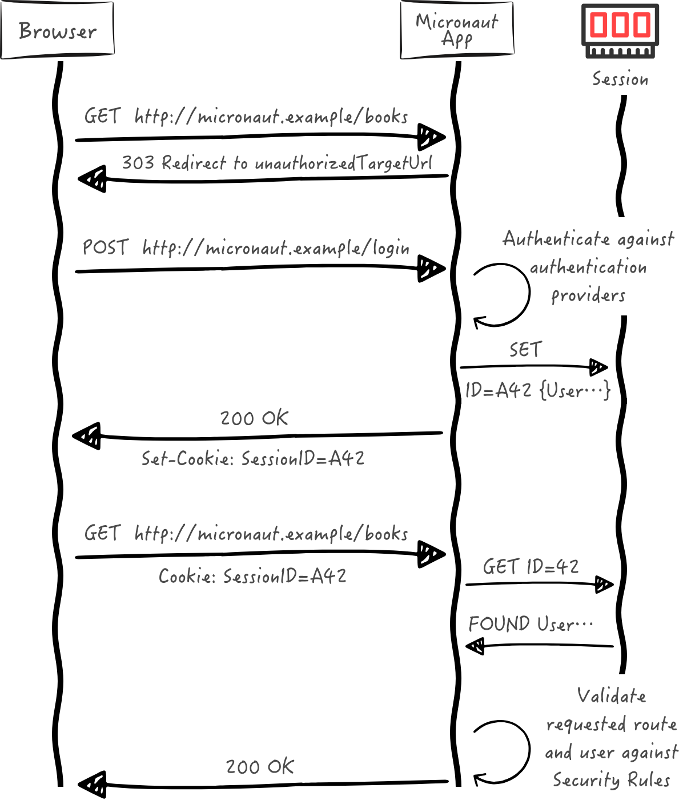
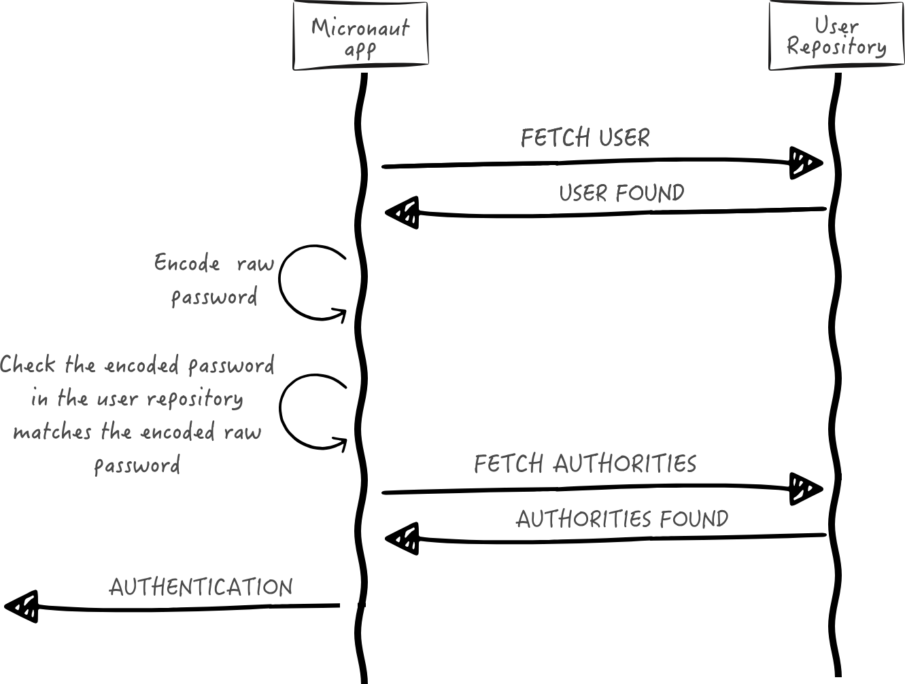

# Database authentication

Aprenda como proteger um aplicativo Micronaut usando autenticação de banco de dados.


Neste guia, criaremos um aplicativo Micronaut escrito em Java com autenticação de sessão e banco de dados.

A sequência a seguir ilustra o fluxo de autenticação:



## Configurando acesso ao banco de dados

```xml
<!-- Add the following to your annotationProcessorPaths element -->
<path>
    <groupId>io.micronaut.data</groupId>
    <artifactId>micronaut-data-processor</artifactId>
</path>
<dependency>
    <groupId>io.micronaut.data</groupId>
    <artifactId>micronaut-data-jdbc</artifactId>
    <scope>compile</scope>
</dependency>
<dependency>
    <groupId>io.micronaut.sql</groupId>
    <artifactId>micronaut-jdbc-hikari</artifactId>
    <scope>compile</scope>
</dependency>
<dependency>
    <groupId>org.postgresql</groupId>
    <artifactId>postgresql</artifactId>
    <scope>runtime</scope>
</dependency>
```


```yaml
datasources:
  default:
	url: jdbc:postgresql://localhost:5432/micronaut
	username: postgres
	password: postgres
	driver-class-name: org.postgresql.Driver
	dialect: POSTGRES
	schema-generate: NONE
```

```xml
<dependency>
    <groupId>io.micronaut.flyway</groupId>
    <artifactId>micronaut-flyway</artifactId>
    <scope>compile</scope>
</dependency>
```


```yaml
flyway:
  datasources:
	default:
	  enabled: true
	  locations: classpath:db/migration
```

```sql

CREATE TABLE role (
    id BIGSERIAL PRIMARY KEY NOT NULL,
    authority varchar(255) NOT NULL
);
CREATE TABLE "user" (
    id BIGSERIAL primary key NOT NULL,
    username varchar(255) NOT NULL,
    password varchar(255) NOT NULL,
    enabled BOOLEAN NOT NULL,
    account_expired BOOLEAN NOT NULL,
    account_locked BOOLEAN NOT NULL,
    password_expired BOOLEAN NOT NULL
);
CREATE TABLE user_role(
    id_role_id BIGINT NOT NULL,
    id_user_id BIGINT NOT NULL,
    FOREIGN KEY (id_role_id) REFERENCES role(id),
    FOREIGN KEY (id_user_id) REFERENCES "user"(id),
    PRIMARY KEY (id_role_id, id_user_id)
);

```

```xml
<dependency>
    <groupId>io.micronaut.security</groupId>
    <artifactId>micronaut-security-session</artifactId>
    <scope>compile</scope>
</dependency>

```

```yaml
micronaut:
  security:
	authentication: session
	redirect:
	  login-success: /
	  login-failure: /user/authFailed
```

## Validação

```xml
<dependency>
    <groupId>io.micronaut.validation</groupId>
    <artifactId>micronaut-validation</artifactId>
    <scope>compile</scope>
</dependency>
<!-- Add the following to your annotationProcessorPaths element -->
<path>
    <groupId>io.micronaut.validation</groupId>
    <artifactId>micronaut-validation-processor</artifactId>
</path>
```

## Reator micronaut

```xml
<dependency>
	<groupId>io.micronaut.reactor</groupId>
	<artifactId>micronaut-reactor</artifactId>
	<scope>compile</scope>
</dependency>

```

## Entidades

## Role

```java
package example.micronaut.entities;

import io.micronaut.core.annotation.Nullable;
import io.micronaut.data.annotation.GeneratedValue;
import io.micronaut.data.annotation.Id;
import io.micronaut.data.annotation.MappedEntity;
import jakarta.validation.constraints.NotBlank;

@MappedEntity
public record Role(@Nullable
                   @Id
                   @GeneratedValue
                   Long id,
                   @NotBlank
                   String authority) {
}
```

## User

```java
package example.micronaut;

public interface UserState {
    String getUsername();

    String getPassword();

    boolean isEnabled();

    boolean isAccountExpired();

    boolean isAccountLocked();

    boolean isPasswordExpired();
}

package example.micronaut.entities;

import example.micronaut.UserState;
import io.micronaut.core.annotation.Nullable;
import io.micronaut.data.annotation.GeneratedValue;
import io.micronaut.data.annotation.Id;
import io.micronaut.data.annotation.MappedEntity;
import jakarta.validation.constraints.NotBlank;

@MappedEntity
public record User(@Nullable
                   @Id
                   @GeneratedValue
                   Long id,
                   @NotBlank
                   String username,
                   @NotBlank
                   String password,
                   boolean enabled,
                   boolean accountExpired,
                   boolean accountLocked,
                   boolean passwordExpired) implements UserState {

    @Override
    public String getUsername() {
        return username;
    }

    @Override
    public String getPassword() {
        return password;
    }

    @Override
    public boolean isEnabled() {
        return enabled;
    }

    @Override
    public boolean isAccountExpired() {
        return accountExpired;
    }

    @Override
    public boolean isAccountLocked() {
        return accountLocked;
    }

    @Override
    public boolean isPasswordExpired() {
        return false;
    }
}
```

### Função do usuario

```java
package example.micronaut.entities;

import io.micronaut.data.annotation.Embeddable;
import io.micronaut.data.annotation.Relation;

import java.util.Objects;

@Embeddable
public class UserRoleId {

    @Relation(value = Relation.Kind.MANY_TO_ONE)
    private final User user;

    @Relation(value = Relation.Kind.MANY_TO_ONE)
    private final Role role;

    public UserRoleId(User user, Role role) {
        this.user = user;
        this.role = role;
    }

    @Override
    public boolean equals(Object o) {
        if (this == o) {
            return true;
        }
        if (o == null || getClass() != o.getClass()) {
            return false;
        }
        UserRoleId userRoleId = (UserRoleId) o;
        return role.id().equals(userRoleId.getRole().id()) &&
                user.id().equals(userRoleId.getUser().id());
    }

    @Override
    public int hashCode() {
        return Objects.hash(role.id(), user.id());
    }

    public User getUser() {
        return user;
    }

    public Role getRole() {
        return role;
    }
}

package example.micronaut.entities;

import io.micronaut.data.annotation.EmbeddedId;
import io.micronaut.data.annotation.MappedEntity;

@MappedEntity
public class UserRole {

    @EmbeddedId
    private final UserRoleId id;

    public UserRole(UserRoleId id) {
        this.id = id;
    }

    public UserRoleId getId() {
        return id;
    }
}
```

## Repositórios

```java
package example.micronaut.repositories;

import example.micronaut.entities.Role;
import io.micronaut.data.jdbc.annotation.JdbcRepository;
import io.micronaut.data.model.query.builder.sql.Dialect;
import io.micronaut.data.repository.CrudRepository;
import java.util.Optional;

@JdbcRepository(dialect = Dialect.POSTGRES)
public interface RoleJdbcRepository extends CrudRepository<Role, Long> {

    Role save(String authority);

    Optional<Role> findByAuthority(String authority);
}
```

```java

package example.micronaut.repositories;

import example.micronaut.entities.User;
import io.micronaut.core.annotation.NonNull;
import io.micronaut.data.jdbc.annotation.JdbcRepository;
import io.micronaut.data.model.query.builder.sql.Dialect;
import io.micronaut.data.repository.CrudRepository;
import jakarta.validation.constraints.NotBlank;

import java.util.Optional;

@JdbcRepository(dialect = Dialect.POSTGRES)
public interface UserJdbcRepository extends CrudRepository<User, Long> {

    Optional<User> findByUsername(@NonNull @NotBlank String username);
}

```

```java

package example.micronaut.repositories;

import example.micronaut.entities.UserRole;
import example.micronaut.entities.UserRoleId;
import io.micronaut.data.annotation.Query;
import io.micronaut.data.jdbc.annotation.JdbcRepository;
import io.micronaut.data.model.query.builder.sql.Dialect;
import io.micronaut.data.repository.CrudRepository;
import jakarta.validation.constraints.NotBlank;

import java.util.List;

@JdbcRepository(dialect = Dialect.POSTGRES)
public interface UserRoleJdbcRepository extends CrudRepository<UserRole, UserRoleId> {

    @Query("""
    SELECT authority FROM role
    INNER JOIN user_role ON user_role.id_role_id = role.id
    INNER JOIN "user" user_ ON user_role.id_user_id = user_.id
    WHERE user_.username = :username""")
    List<String> findAllAuthoritiesByUsername(@NotBlank String username);
}

```

## Codificador de senha


```xml
<dependency>
    <groupId>org.springframework.security</groupId>
    <artifactId>spring-security-crypto</artifactId>
    <version>6.2.0</version>
    <scope>compile</scope>
</dependency>
<dependency>
    <groupId>org.slf4j</groupId>
    <artifactId>jcl-over-slf4j</artifactId>
    <scope>compile</scope>
</dependency>
```

```java
package example.micronaut;

import jakarta.validation.constraints.NotBlank;

public interface PasswordEncoder {

    String encode(@NotBlank String rawPassword);

    boolean matches(@NotBlank String rawPassword,
                    @NotBlank String encodedPassword);
}
```

```java
package example.micronaut;

import io.micronaut.core.annotation.NonNull;
import org.springframework.security.crypto.bcrypt.BCryptPasswordEncoder;
import jakarta.inject.Singleton;
import jakarta.validation.constraints.NotBlank;

@Singleton
class BCryptPasswordEncoderService implements PasswordEncoder {

    org.springframework.security.crypto.password.PasswordEncoder delegate = new BCryptPasswordEncoder();

    public String encode(@NotBlank @NonNull String rawPassword) {
        return delegate.encode(rawPassword);
    }

    @Override
    public boolean matches(@NotBlank @NonNull String rawPassword,
                           @NotBlank @NonNull String encodedPassword) {
        return delegate.matches(rawPassword, encodedPassword);
    }
}
```


## Serviço de registro

```java

package example.micronaut;

import example.micronaut.entities.Role;
import example.micronaut.entities.User;
import example.micronaut.entities.UserRole;
import example.micronaut.entities.UserRoleId;
import example.micronaut.exceptions.UserAlreadyExistsException;
import example.micronaut.repositories.RoleJdbcRepository;
import example.micronaut.repositories.UserJdbcRepository;
import example.micronaut.repositories.UserRoleJdbcRepository;
import io.micronaut.core.annotation.Nullable;
import jakarta.inject.Singleton;
import jakarta.transaction.Transactional;
import jakarta.validation.constraints.NotBlank;
import java.util.Collections;
import java.util.List;
import java.util.Optional;

@Singleton
public class RegisterService {

    private static final boolean DEFAULT_ENABLED = true;
    private static final boolean DEFAULT_ACCOUNT_EXPIRED = false;

    private static final boolean DEFAULT_ACCOUNT_LOCKED = false;

    private static final boolean DEFAULT_PASSWORD_EXPIRED = false;
    private final RoleJdbcRepository roleService;
    private final UserJdbcRepository userJdbcRepository;
    private final UserRoleJdbcRepository userRoleJdbcRepository;
    private final PasswordEncoder passwordEncoder;

    public RegisterService(RoleJdbcRepository roleGormService,
                    UserJdbcRepository userJdbcRepository,
                    PasswordEncoder passwordEncoder,
                    UserRoleJdbcRepository userRoleJdbcRepository) {
        this.roleService = roleGormService;
        this.userJdbcRepository = userJdbcRepository;
        this.userRoleJdbcRepository = userRoleJdbcRepository;
        this.passwordEncoder = passwordEncoder;
    }

    public void register(@NotBlank String username,
                         @NotBlank String rawPassword) {
        register(username, rawPassword, Collections.emptyList());
    }

    @Transactional
    public void register(@NotBlank String username,
                         @NotBlank String rawPassword,
                         @Nullable List<String> authorities) {
        Optional<User> userOptional = userJdbcRepository.findByUsername(username);
        if (userOptional.isPresent()) {
            throw new UserAlreadyExistsException();
        }
        User user = userJdbcRepository.save(createUser(username, rawPassword));
        if (user != null && authorities != null) {
            for (String authority : authorities) {
                Role role = roleService.findByAuthority(authority).orElseGet(() -> roleService.save(authority));
                UserRoleId userRoleId = new UserRoleId(user, role);
                if (userRoleJdbcRepository.findById(userRoleId).isEmpty()) {
                    userRoleJdbcRepository.save(new UserRole(userRoleId));
                }
            }
        }
    }

    private User createUser(String username, String rawPassword) {
        final String encodedPassword = passwordEncoder.encode(rawPassword);
        return new User(null,
                username,
                encodedPassword,
                DEFAULT_ENABLED,
                DEFAULT_ACCOUNT_EXPIRED,
                DEFAULT_ACCOUNT_LOCKED,
                DEFAULT_PASSWORD_EXPIRED);
    }
}
```

```java
package example.micronaut.exceptions;

public class UserAlreadyExistsException extends RuntimeException {
}

```

## Delegando Provedor de Autenticação




### Buscando usuario

```java

package example.micronaut;

import io.micronaut.core.annotation.NonNull;
import jakarta.validation.constraints.NotBlank;

import java.util.Optional;

interface UserFetcher {

    Optional<UserState> findByUsername(@NotBlank @NonNull String username);
}

package example.micronaut;

import example.micronaut.repositories.UserJdbcRepository;
import io.micronaut.core.annotation.NonNull;
import jakarta.inject.Singleton;
import jakarta.validation.constraints.NotBlank;

import java.util.Optional;

@Singleton
class UserFetcherService implements UserFetcher {

    private final UserJdbcRepository userJdbcRepository;

    UserFetcherService(UserJdbcRepository userJdbcRepository) {
        this.userJdbcRepository = userJdbcRepository;
    }

    @Override
    public Optional<UserState> findByUsername(@NotBlank @NonNull String username) {
        return userJdbcRepository.findByUsername(username).map(UserState.class::cast);
    }
}


```

### Buscando roles

```java

package example.micronaut;

import java.util.List;

public interface AuthoritiesFetcher {

    List<String> findAuthoritiesByUsername(String username);
}

package example.micronaut;

import example.micronaut.repositories.UserRoleJdbcRepository;
import jakarta.inject.Singleton;

import java.util.List;

@Singleton
class AuthoritiesFetcherService implements AuthoritiesFetcher {

    private final UserRoleJdbcRepository userRoleJdbcRepository;

    AuthoritiesFetcherService(UserRoleJdbcRepository userRoleJdbcRepository) {
        this.userRoleJdbcRepository = userRoleJdbcRepository;
    }

    @Override
    public List<String> findAuthoritiesByUsername(String username) {
        return userRoleJdbcRepository.findAllAuthoritiesByUsername(username);
    }
}

```

## Provedor de autenticação

```java
package example.micronaut;

import io.micronaut.core.annotation.NonNull;
import io.micronaut.core.annotation.Nullable;
import io.micronaut.http.HttpRequest;
import io.micronaut.scheduling.TaskExecutors;
import io.micronaut.security.authentication.AuthenticationException;
import io.micronaut.security.authentication.AuthenticationFailed;
import io.micronaut.security.authentication.AuthenticationRequest;
import io.micronaut.security.authentication.AuthenticationResponse;
import io.micronaut.security.authentication.provider.HttpRequestReactiveAuthenticationProvider;
import reactor.core.publisher.FluxSink;
import reactor.core.publisher.Flux;
import reactor.core.scheduler.Scheduler;
import reactor.core.scheduler.Schedulers;
import org.reactivestreams.Publisher;
import jakarta.inject.Named;
import jakarta.inject.Singleton;

import java.util.List;
import java.util.concurrent.ExecutorService;

import static io.micronaut.security.authentication.AuthenticationFailureReason.ACCOUNT_EXPIRED;
import static io.micronaut.security.authentication.AuthenticationFailureReason.ACCOUNT_LOCKED;
import static io.micronaut.security.authentication.AuthenticationFailureReason.CREDENTIALS_DO_NOT_MATCH;
import static io.micronaut.security.authentication.AuthenticationFailureReason.PASSWORD_EXPIRED;
import static io.micronaut.security.authentication.AuthenticationFailureReason.USER_DISABLED;
import static io.micronaut.security.authentication.AuthenticationFailureReason.USER_NOT_FOUND;

@Singleton
class DelegatingAuthenticationProvider<B> implements HttpRequestReactiveAuthenticationProvider<B> {

    private final UserFetcher userFetcher;
    private final PasswordEncoder passwordEncoder;
    private final AuthoritiesFetcher authoritiesFetcher;
    private final Scheduler scheduler;

    DelegatingAuthenticationProvider(UserFetcher userFetcher,
                                     PasswordEncoder passwordEncoder,
                                     AuthoritiesFetcher authoritiesFetcher,
                                     @Named(TaskExecutors.BLOCKING) ExecutorService executorService) {
        this.userFetcher = userFetcher;
        this.passwordEncoder = passwordEncoder;
        this.authoritiesFetcher = authoritiesFetcher;
        this.scheduler = Schedulers.fromExecutorService(executorService);
    }

    @Override
    @NonNull
    public  Publisher<AuthenticationResponse> authenticate(
            @Nullable HttpRequest<B> requestContext,
            @NonNull AuthenticationRequest<String, String> authenticationRequest
    ) {
        return Flux.<AuthenticationResponse>create(emitter -> {
            UserState user = fetchUserState(authenticationRequest);
            AuthenticationFailed authenticationFailed = validate(user, authenticationRequest);
            if (authenticationFailed != null) {
                emitter.error(new AuthenticationException(authenticationFailed));
            } else {
                emitter.next(createSuccessfulAuthenticationResponse(user));
                emitter.complete();
            }
        }, FluxSink.OverflowStrategy.ERROR).subscribeOn(scheduler);
    }

    private AuthenticationFailed validate(UserState user, AuthenticationRequest<?, ?> authenticationRequest) {
        AuthenticationFailed authenticationFailed = null;
        if (user == null) {
            authenticationFailed = new AuthenticationFailed(USER_NOT_FOUND);

        } else if (!user.isEnabled()) {
            authenticationFailed = new AuthenticationFailed(USER_DISABLED);

        } else if (user.isAccountExpired()) {
            authenticationFailed = new AuthenticationFailed(ACCOUNT_EXPIRED);

        } else if (user.isAccountLocked()) {
            authenticationFailed = new AuthenticationFailed(ACCOUNT_LOCKED);

        } else if (user.isPasswordExpired()) {
            authenticationFailed = new AuthenticationFailed(PASSWORD_EXPIRED);

        } else if (!passwordEncoder.matches(authenticationRequest.getSecret().toString(), user.getPassword())) {
            authenticationFailed = new AuthenticationFailed(CREDENTIALS_DO_NOT_MATCH);
        }

        return authenticationFailed;
    }

    private UserState fetchUserState(AuthenticationRequest<?, ?> authRequest) {
        final Object username = authRequest.getIdentity();
        return userFetcher.findByUsername(username.toString()).orElse(null);
    }

    private AuthenticationResponse createSuccessfulAuthenticationResponse(UserState user) {
        List<String> authorities = authoritiesFetcher.findAuthoritiesByUsername(user.getUsername());
        return AuthenticationResponse.success(user.getUsername(), authorities);
    }
}
```
