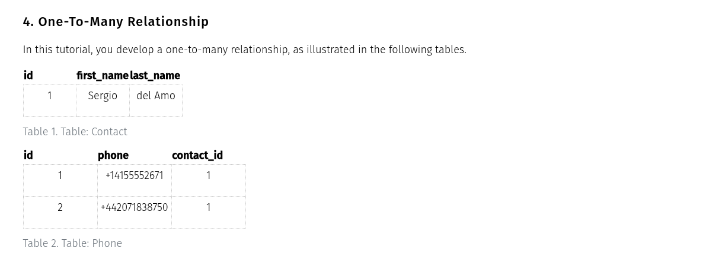

# Database Modeling

## One-To-Many with Micronaut Data JDBC



### Configuração do banco de dados

```yaml

datasources:
  default:
	url: jdbc:h2:mem:default;DB_CLOSE_DELAY=-1;DB_CLOSE_ON_EXIT=FALSE
	driverClassName: org.h2.Driver
	dialect: H2
	username: sa
	password:
	schema-generate: CREATE_DROP
	schema-generate-logging: true

```

### Migrations com Liquibase

```xml
<dependency>
    <groupId>io.micronaut.liquibase</groupId>
    <artifactId>micronaut-liquibase</artifactId>
    <scope>compile</scope>
</dependency>
```

```yaml
liquibase:
  change-log: classpath:db/changelog/db.changelog-master.yaml
```

```xml
<?xml version="1.0" encoding="UTF-8"?>
<databaseChangeLog
  xmlns="http://www.liquibase.org/xml/ns/dbchangelog"
  xmlns:xsi="http://www.w3.org/2001/XMLSchema-instance"
  xsi:schemaLocation="http://www.liquibase.org/xml/ns/dbchangelog
         http://www.liquibase.org/xml/ns/dbchangelog/dbchangelog-3.1.xsd">
  <include file="changelog/01-schema.xml" relativeToChangelogFile="true"/>
</databaseChangeLog>
```

```xml
<?xml version="1.0" encoding="UTF-8"?>

<databaseChangeLog
        xmlns="http://www.liquibase.org/xml/ns/dbchangelog"
        xmlns:xsi="http://www.w3.org/2001/XMLSchema-instance"
        xsi:schemaLocation="http://www.liquibase.org/xml/ns/dbchangelog
         http://www.liquibase.org/xml/ns/dbchangelog/dbchangelog-3.1.xsd">
  <changeSet id="01" author="username">
    <createTable tableName="contact">
      <column name="id" type="BIGINT" autoIncrement="true">
        <constraints nullable="false"
                     unique="true"
                     primaryKey="true"
                     primaryKeyName="pk_contact"/>
      </column>

      <column name="first_name" type="VARCHAR(255)">
        <constraints nullable="true"/>
      </column>

      <column name="last_name" type="VARCHAR(255)">
        <constraints nullable="true"/>
      </column>
    </createTable>

    <createTable tableName="phone">
      <column name="id" type="BIGINT" autoIncrement="true">
        <constraints nullable="false"
                     unique="true"
                     primaryKey="true"
                     primaryKeyName="pk_phone"/>
      </column>
      <column name="phone" type="VARCHAR(20)">
        <constraints nullable="false"/>
      </column>

      <column name="contact_id" type="BIGINT">
        <constraints nullable="false"/>
      </column>
    </createTable>

    <addForeignKeyConstraint baseTableName="phone"
                             baseColumnNames="contact_id"
                             constraintName="fk_phone_contact"
                             referencedTableName="contact"
                             referencedColumnNames="id"/>
    <rollback>
      <dropTable tableName="phone"/>
      <dropTable tableName="contact"/>
    </rollback>
  </changeSet>
</databaseChangeLog>
```

### Entidade

```java
package example.micronaut;

import io.micronaut.core.annotation.Nullable;
import io.micronaut.core.util.StringUtils;
import io.micronaut.data.annotation.GeneratedValue;
import io.micronaut.data.annotation.Id;
import io.micronaut.data.annotation.MappedEntity;
import io.micronaut.data.annotation.Relation;

import java.util.List;

@MappedEntity("contact")
public record ContactEntity(
        @Id
        @GeneratedValue
        @Nullable
        Long id,

        @Nullable
        String firstName,

        @Nullable
        String lastName,

        @Nullable
        @Relation(value = Relation.Kind.ONE_TO_MANY, mappedBy = "contact")
        List<PhoneEntity>phones
) {
}


package example.micronaut;

import io.micronaut.core.annotation.NonNull;
import io.micronaut.core.annotation.Nullable;
import io.micronaut.data.annotation.GeneratedValue;
import io.micronaut.data.annotation.Id;
import io.micronaut.data.annotation.MappedEntity;
import io.micronaut.data.annotation.Relation;
@MappedEntity("phone")
public record PhoneEntity(
        @Id
        @GeneratedValue
        @Nullable
        Long id,

        @NonNull
        String phone,

        @Nullable
        @Relation(value = Relation.Kind.MANY_TO_ONE)
        ContactEntity contact
) {
}

```

### Projections

```java

package example.micronaut;

import io.micronaut.core.annotation.Introspected;
import io.micronaut.core.annotation.NonNull;
import io.micronaut.core.annotation.Nullable;

import java.util.Set;

@Introspected
public record ContactComplete(
        @NonNull Long id,
        @Nullable String firstName,
        @Nullable String lastName,
        @Nullable Set<String> phones) {
}

package example.micronaut;

import io.micronaut.core.annotation.Introspected;
import io.micronaut.core.annotation.NonNull;
import io.micronaut.core.annotation.Nullable;

@Introspected
public record ContactPreview(
        @NonNull Long id,
        @Nullable String firstName,
        @Nullable String lastName
) {
}

```

### Repositório

```java

package example.micronaut;

import io.micronaut.core.annotation.NonNull;
import io.micronaut.data.jdbc.annotation.JdbcRepository;
import io.micronaut.data.model.query.builder.sql.Dialect;
import io.micronaut.data.repository.CrudRepository;

@JdbcRepository(dialect = Dialect.H2)
public interface PhoneRepository extends CrudRepository<PhoneEntity, Long> {
    void deleteByContact(@NonNull ContactEntity contact);
}

```java
package example.micronaut;

import io.micronaut.core.annotation.NonNull;
import io.micronaut.data.annotation.Join;
import io.micronaut.data.annotation.Query;
import io.micronaut.data.jdbc.annotation.JdbcRepository;
import io.micronaut.data.model.query.builder.sql.Dialect;
import io.micronaut.data.repository.CrudRepository;

import java.util.Optional;

@JdbcRepository(dialect = Dialect.H2)//1
public interface ContactRepository extends CrudRepository<ContactEntity, Long> { //2
    @Join(value = "phones", type = Join.Type.LEFT_FETCH)//3
    Optional<ContactEntity> getById(@NonNull Long id);

    @Query("select id, first_name, last_name from contact where id = :id")//4
    Optional<ContactPreview> findPreviewById(@NonNull Long id); //usar a projeção ContactPreview

    @Query("""
select c.id, c.first_name, c.last_name, group_concat(p.phone) as phones
 from contact c
 left outer join phone p on c.id = p.contact_id
 where c.id = :id
 group by c.id""")//5
    Optional<ContactComplete> findCompleteById(@NonNull Long id);//usar a projeção ContactComplete
}

```

1. `@JdbcRepository(dialect = Dialect.H2)` - O repositório é um repositório JDBC e o banco de dados é H2.
2. `CrudRepository<ContactEntity, Long>` - O repositório é um repositório CRUD e a entidade é `ContactEntity` e o tipo da chave primária é `Long`.
3. `@Join(value = "phones", type = Join.Type.LEFT_FETCH)` - O repositório irá buscar a entidade `PhoneEntity` e o tipo de junção é `LEFT_FETCH`.
5. `@Query` - O repositório irá executar a consulta SQL e retornar o resultado.

### Testes

```java
package example.micronaut;

import io.micronaut.test.extensions.junit5.annotation.MicronautTest;
import jakarta.inject.Inject;
import org.junit.jupiter.api.Test;

import java.util.*;

import static org.junit.jupiter.api.Assertions.*;

@MicronautTest(startApplication = false, transactional = false)
class ContactRepositoryTest {

    @Inject
    ContactRepository contactRepository;

    @Inject
    PhoneRepository phoneRepository;

    @Test
    void testAssociationsQuerying() {
        String firstName = "Sergio";
        String lastName = "Sergio";
        long contactCount = contactRepository.count();
        ContactEntity e = contactRepository.save(new ContactEntity(null, firstName, lastName, null));
        assertEquals(1 + contactCount, contactRepository.count());

        Optional<ContactPreview> preview = contactRepository.findPreviewById(e.id());
        assertTrue(preview.isPresent());
        assertEquals(new ContactPreview(e.id(), firstName, lastName), preview.get());

        // Query with @Join
        Optional<ContactEntity> contactEntity = contactRepository.getById(e.id());
        assertTrue(contactEntity.isPresent());
        ContactEntity expected = new ContactEntity(contactEntity.get().id(),
                firstName,
                lastName,
                Collections.emptyList());
        assertEquals(expected, contactEntity.get());

        Optional<ContactComplete> complete = contactRepository.findCompleteById(e.id());
        assertTrue(complete.isPresent());
        assertEquals(new ContactComplete(e.id(), firstName, lastName, null), complete.get());

        String americanPhone = "+14155552671";
        String ukPhone = "+442071838750";
        long phoneCount = phoneRepository.count();
        ContactEntity contactReference = new ContactEntity(e.id(), null, null, null);
        PhoneEntity usPhoneEntity = phoneRepository.save(new PhoneEntity(null, americanPhone, contactReference));
        PhoneEntity ukPhoneEntity =phoneRepository.save(new PhoneEntity(null, ukPhone, contactReference));
        assertEquals(2 + phoneCount, phoneRepository.count());

        // Projection without join with @Query
        preview = contactRepository.findPreviewById(e.id());
        assertTrue(preview.isPresent());
        assertEquals(new ContactPreview(e.id(), firstName, lastName), preview.get());

        // findById without @Join
        contactEntity = contactRepository.findById(e.id());
        assertTrue(contactEntity.isPresent());
        assertEquals(new ContactEntity(contactEntity.get().id(), firstName, lastName, Collections.emptyList()), contactEntity.get());

        // Query with @Join
        contactEntity = contactRepository.getById(e.id());
        assertTrue(contactEntity.isPresent());
        expected = new ContactEntity(contactEntity.get().id(),
                firstName,
                lastName,
                List.of(
                        new PhoneEntity(usPhoneEntity.id(), usPhoneEntity.phone(), new ContactEntity(e.id(), e.firstName(), e.lastName(), Collections.emptyList())),
                        new PhoneEntity(ukPhoneEntity.id(), ukPhoneEntity.phone(), new ContactEntity(e.id(), e.firstName(), e.lastName(), Collections.emptyList()))));
        assertEquals(expected, contactEntity.get());

        // Projection with join with @Query
        complete = contactRepository.findCompleteById(e.id());
        assertTrue(complete.isPresent());
        assertEquals(new ContactComplete(e.id(), firstName, lastName, Set.of(americanPhone, ukPhone)), complete.get());

        //cleanup
        phoneRepository.deleteByContact(contactReference);
        contactRepository.deleteById(e.id());
        assertEquals(phoneCount, phoneRepository.count());
        assertEquals(contactCount, contactRepository.count());
    }

}

```
