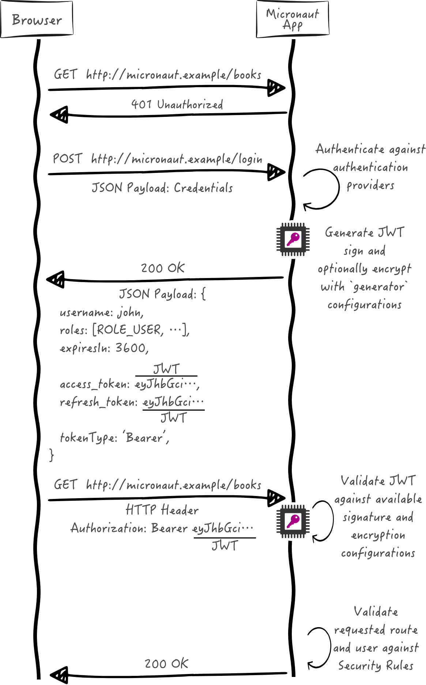

# Micronaut Security

## Autenticação básica do Micronaut

Neste guia, criaremos um aplicativo Micronaut escrito em Java e o protegeremos com HTTP Basic Auth.

O RFC7617 define o esquema de autenticação "Básico" do Protocolo de Transferência de Hipertexto (HTTP), que transmite credenciais como pares de ID de usuário/senha, codificados usando Base64.

## Provedor de Autenticação

Para manter este guia simples, crie um ingênuo AuthenticationProviderpara simular a autenticação do usuário.

```java
package example.micronaut;

import io.micronaut.core.annotation.NonNull;
import io.micronaut.core.annotation.Nullable;
import io.micronaut.http.HttpRequest;
import io.micronaut.security.authentication.AuthenticationFailureReason;
import io.micronaut.security.authentication.AuthenticationRequest;
import io.micronaut.security.authentication.AuthenticationResponse;
import io.micronaut.security.authentication.provider.HttpRequestAuthenticationProvider;
import jakarta.inject.Singleton;

@Singleton
class AuthenticationProviderUserPassword<B> implements HttpRequestAuthenticationProvider<B> {

    public AuthenticationResponse authenticate(
            @Nullable HttpRequest<B> httpRequest,
            @NonNull AuthenticationRequest<String, String> authenticationRequest
    ) {
        return authenticationRequest.getIdentity().equals("sherlock") && authenticationRequest.getSecret().equals("password")
                ? AuthenticationResponse.success(authenticationRequest.getIdentity())
                : AuthenticationResponse.failure(AuthenticationFailureReason.CREDENTIALS_DO_NOT_MATCH);
    }
}
```

1. O método `authenticate` é chamado quando o usuário tenta fazer login. Ele verifica se o nome de usuário e a senha estão corretos e retorna um objeto `AuthenticationResponse` apropriado.
2. Se o nome de usuário e a senha estiverem corretos, o método retorna `AuthenticationResponse.success(authenticationRequest.getIdentity())`, que indica que a autenticação foi bem-sucedida.

### Controlador

```java
package example.micronaut;

import io.micronaut.http.MediaType;
import io.micronaut.http.annotation.Controller;
import io.micronaut.http.annotation.Get;
import io.micronaut.http.annotation.Produces;
import io.micronaut.security.annotation.Secured;
import io.micronaut.security.rules.SecurityRule;

import java.security.Principal;

@Secured(SecurityRule.IS_AUTHENTICATED) //1
@Controller//2
public class HomeController {

    @Produces(MediaType.TEXT_PLAIN)
    @Get//3
    String index(Principal principal) {//4
        return principal.getName();
    }
}
```

1. O controlador é protegido pela anotação `@Secured(SecurityRule.IS_AUTHENTICATED)`, o que significa que apenas usuários autenticados podem acessá-lo.
2. O controlador é anotado com `@Controller`, o que o torna um controlador REST.
3. O método `index` é mapeado para o caminho raiz ("/") e retorna uma string simples.
4. O método `index` recebe um objeto `Principal`, que contém informações sobre o usuário autenticado. O nome do usuário é retornado como resposta.


### Substitua o Manipulador de Exceções padrão por AuthorizationExceptionHandler, a exceção gerada quando uma solicitação não é autorizada.

```java

package example.micronaut;

import io.micronaut.context.annotation.Replaces;
import io.micronaut.core.annotation.Nullable;
import io.micronaut.http.HttpRequest;
import io.micronaut.http.HttpResponse;
import io.micronaut.http.MutableHttpResponse;
import io.micronaut.http.server.exceptions.response.ErrorResponseProcessor;
import io.micronaut.security.authentication.AuthorizationException;
import io.micronaut.security.authentication.DefaultAuthorizationExceptionHandler;
import io.micronaut.security.config.RedirectConfiguration;
import io.micronaut.security.config.RedirectService;
import io.micronaut.security.errors.PriorToLoginPersistence;
import jakarta.inject.Singleton;

import static io.micronaut.http.HttpHeaders.WWW_AUTHENTICATE;
import static io.micronaut.http.HttpStatus.FORBIDDEN;
import static io.micronaut.http.HttpStatus.UNAUTHORIZED;

@Singleton //1
@Replaces(DefaultAuthorizationExceptionHandler.class)//2
public class DefaultAuthorizationExceptionHandlerReplacement extends DefaultAuthorizationExceptionHandler {

    public DefaultAuthorizationExceptionHandlerReplacement(
            ErrorResponseProcessor<?> errorResponseProcessor,
            RedirectConfiguration redirectConfiguration,
            RedirectService redirectService,
            @Nullable PriorToLoginPersistence priorToLoginPersistence
    ) {
        super(errorResponseProcessor, redirectConfiguration, redirectService, priorToLoginPersistence);
    }

    @Override
    protected MutableHttpResponse<?> httpResponseWithStatus(HttpRequest request,
                                                            AuthorizationException e) {
        if (e.isForbidden()) {
            return HttpResponse.status(FORBIDDEN);
        }
        return HttpResponse.status(UNAUTHORIZED)
                .header(WWW_AUTHENTICATE, "Basic realm=\"Micronaut Guide\"");
    }
}
```

1. A anotação `@Singleton` indica que esta classe é um bean gerenciado pelo Micronaut.
2. A anotação `@Replaces` indica que esta classe substitui a implementação padrão do `DefaultAuthorizationExceptionHandler`.

### Testes

```java
package example.micronaut;

import io.micronaut.http.HttpRequest;
import io.micronaut.http.HttpResponse;
import io.micronaut.http.client.HttpClient;
import io.micronaut.http.client.annotation.Client;
import io.micronaut.http.client.exceptions.HttpClientResponseException;
import io.micronaut.test.extensions.junit5.annotation.MicronautTest;
import jakarta.inject.Inject;
import org.junit.jupiter.api.Test;
import org.junit.jupiter.api.function.Executable;

import static io.micronaut.http.HttpStatus.OK;
import static io.micronaut.http.HttpStatus.UNAUTHORIZED;
import static io.micronaut.http.MediaType.TEXT_PLAIN;
import static org.junit.jupiter.api.Assertions.assertEquals;
import static org.junit.jupiter.api.Assertions.assertThrows;
import static org.junit.jupiter.api.Assertions.assertTrue;

@MicronautTest
public class BasicAuthTest {

    @Inject
    @Client("/")
    HttpClient client;

    @Test
    void verifyHttpBasicAuthWorks() {
        //when: 'Accessing a secured URL without authenticating'
        Executable e = () -> client.toBlocking().exchange(HttpRequest.GET("/").accept(TEXT_PLAIN));

        // then: 'returns unauthorized'
        HttpClientResponseException thrown = assertThrows(HttpClientResponseException.class, e);
        assertEquals(UNAUTHORIZED, thrown.getStatus());

        assertTrue(thrown.getResponse().getHeaders().contains("WWW-Authenticate"));
        assertEquals("Basic realm=\"Micronaut Guide\"", thrown.getResponse().getHeaders().get("WWW-Authenticate"));

        //when: 'A secured URL is accessed with Basic Auth'
        HttpResponse<String> rsp = client.toBlocking().exchange(HttpRequest.GET("/")
                        .accept(TEXT_PLAIN)
                        .basicAuth("sherlock", "password"),
                String.class);
        //then: 'the endpoint can be accessed'
        assertEquals(OK, rsp.getStatus());
        assertEquals("sherlock", rsp.getBody().get());
    }
}

```

###  Use o cliente HTTP Micronaut e a autenticação básica

Se quiser acessar um ponto de extremidade seguro, você também pode usar um cliente HTTP Micronaut e fornecer a autenticação básica como o valor do cabeçalho de autorização.

Primeiro crie um `@Client` com um método homeque aceite um Authorizationcabeçalho HTTP.

```java
package example.micronaut;

import io.micronaut.http.annotation.Consumes;
import io.micronaut.http.annotation.Get;
import io.micronaut.http.annotation.Header;
import io.micronaut.http.client.annotation.Client;

import static io.micronaut.http.MediaType.TEXT_PLAIN;

@Client("/")
public interface AppClient {

    @Consumes(TEXT_PLAIN)
    @Get
    String home(@Header String authorization);
}
```

1. O método consome texto simples, então a estrutura do Micronaut inclui o cabeçalho HTTP Accept: text/plain.
2. O primeiro caractere do nome do parâmetro é escrito em maiúscula e esse valor ( Authorization) é usado como nome do cabeçalho HTTP. Para alterar o nome do parâmetro, especifique o @Headervalor da anotação.


```java
package example.micronaut;

import io.micronaut.test.extensions.junit5.annotation.MicronautTest;
import jakarta.inject.Inject;
import org.junit.jupiter.api.Test;

import java.util.Base64;

import static org.junit.jupiter.api.Assertions.assertEquals;

@MicronautTest
public class BasicAuthClientTest {

    @Inject
    AppClient appClient;

    @Test
    void verifyBasicAuthWorks() {
        String creds = basicAuth("sherlock", "password");
        String rsp = appClient.home(creds);
        assertEquals("sherlock", rsp);
    }
    private static String basicAuth(String username, String password) {
        return "Basic " + Base64.getEncoder().encodeToString((username + ":" + password).getBytes());
    }
}
```

## Micronaut JWT Authentication
O framework Micronaut vem com recursos de segurança baseados em JSON Web Token (JWT) . JWT é um padrão IETF que define uma maneira segura de encapsular dados arbitrários que podem ser enviados por URLs inseguras.

Neste guia, você criará um aplicativo Micronaut escrito em Java e o protegerá com JWT.

A sequência a seguir ilustra o fluxo de autenticação:




## Configuração


```yaml

micronaut:
  security:
	token:
	  jwt:
		signatures:
		  secret:
			generator:
			  secret: "${JWT_GENERATOR_SIGNATURE_SECRET:pleaseChangeThisSecretForANewOne}"

```

### Provedor de Autenticação


```java
package example.micronaut;

import io.micronaut.core.annotation.NonNull;
import io.micronaut.core.annotation.Nullable;
import io.micronaut.http.HttpRequest;
import io.micronaut.security.authentication.AuthenticationFailureReason;
import io.micronaut.security.authentication.AuthenticationRequest;
import io.micronaut.security.authentication.AuthenticationResponse;
import io.micronaut.security.authentication.provider.HttpRequestAuthenticationProvider;
import jakarta.inject.Singleton;

@Singleton
class AuthenticationProviderUserPassword<B> implements HttpRequestAuthenticationProvider<B> {

    @Override
    public AuthenticationResponse authenticate(
            @Nullable HttpRequest<B> httpRequest,
            @NonNull AuthenticationRequest<String, String> authenticationRequest
    ) {
        return authenticationRequest.getIdentity().equals("sherlock") && authenticationRequest.getSecret().equals("password")
                ? AuthenticationResponse.success(authenticationRequest.getIdentity())
                : AuthenticationResponse.failure(AuthenticationFailureReason.CREDENTIALS_DO_NOT_MATCH);
    }
}

```

### Controlador

```java
package example.micronaut;

import io.micronaut.http.MediaType;
import io.micronaut.http.annotation.Controller;
import io.micronaut.http.annotation.Get;
import io.micronaut.http.annotation.Produces;
import io.micronaut.security.annotation.Secured;
import io.micronaut.security.rules.SecurityRule;

import java.security.Principal;

@Secured(SecurityRule.IS_AUTHENTICATED)
@Controller
public class HomeController {

    @Produces(MediaType.TEXT_PLAIN)
    @Get
    public String index(Principal principal) {
        return principal.getName();
    }
}
```

1. Anote com `io.micronaut.security.Secured`para configurar o acesso seguro. A "isAuthenticated()" expressão permitirá acesso apenas a usuários autenticados.
2. Anote com io.micronaut.http.annotation.Controllerpara designar a classe como um controlador Micronaut.
3. Você pode especificar o verbo HTTP ao qual uma ação do controlador responde. Para responder a uma solicitação GET, use a `io.micronaut.http.annotation`.`Get` anotação.
Se um usuário for autenticado, a estrutura do Micronaut vinculará o objeto do usuário a um argumento do tipo java.security.Principal(se presente).


### Testes

```java

package example.micronaut;

import com.nimbusds.jwt.JWTParser;
import com.nimbusds.jwt.SignedJWT;
import io.micronaut.http.HttpRequest;
import io.micronaut.http.HttpResponse;
import io.micronaut.http.client.HttpClient;
import io.micronaut.http.client.annotation.Client;
import io.micronaut.http.client.exceptions.HttpClientResponseException;
import io.micronaut.security.authentication.UsernamePasswordCredentials;
import io.micronaut.security.token.render.BearerAccessRefreshToken;
import io.micronaut.test.extensions.junit5.annotation.MicronautTest;
import jakarta.inject.Inject;
import org.junit.jupiter.api.Test;

import java.text.ParseException;

import static io.micronaut.http.HttpStatus.OK;
import static io.micronaut.http.HttpStatus.UNAUTHORIZED;
import static io.micronaut.http.MediaType.TEXT_PLAIN;
import static org.junit.jupiter.api.Assertions.assertEquals;
import static org.junit.jupiter.api.Assertions.assertNotNull;
import static org.junit.jupiter.api.Assertions.assertThrows;
import static org.junit.jupiter.api.Assertions.assertTrue;

@MicronautTest
class JwtAuthenticationTest {

    @Inject
    @Client("/")
    HttpClient client;

    @Test
    void accessingASecuredUrlWithoutAuthenticatingReturnsUnauthorized() {
        HttpClientResponseException e = assertThrows(HttpClientResponseException.class, () -> {
            client.toBlocking().exchange(HttpRequest.GET("/").accept(TEXT_PLAIN));
        });

        assertEquals(UNAUTHORIZED, e.getStatus());
    }

    @Test
    void uponSuccessfulAuthenticationAJsonWebTokenIsIssuedToTheUser() throws ParseException {
        UsernamePasswordCredentials creds = new UsernamePasswordCredentials("sherlock", "password");
        HttpRequest<?> request = HttpRequest.POST("/login", creds);
        HttpResponse<BearerAccessRefreshToken> rsp = client.toBlocking().exchange(request, BearerAccessRefreshToken.class);
        assertEquals(OK, rsp.getStatus());

        BearerAccessRefreshToken bearerAccessRefreshToken = rsp.body();
        assertEquals("sherlock", bearerAccessRefreshToken.getUsername());
        assertNotNull(bearerAccessRefreshToken.getAccessToken());
        assertTrue(JWTParser.parse(bearerAccessRefreshToken.getAccessToken()) instanceof SignedJWT);

        String accessToken = bearerAccessRefreshToken.getAccessToken();
        HttpRequest<?> requestWithAuthorization = HttpRequest.GET("/")
                .accept(TEXT_PLAIN)
                .bearerAuth(accessToken);
        HttpResponse<String> response = client.toBlocking().exchange(requestWithAuthorization, String.class);

        assertEquals(OK, rsp.getStatus());
        assertEquals("sherlock", response.body());
    }
}

```

1. **Anote a classe com `@MicronautTest`** para que o framework Micronaut inicialize o contexto da aplicação e o servidor embarcado. [Mais informações](https://micronaut-projects.github.io/micronaut-test/latest/guide/).

2. **Injete o `HttpClient` bean** e aponte-o para o servidor incorporado.

3. **Quando você inclui as dependências de segurança**, a segurança é considerada habilitada e cada endpoint é protegido por padrão.

4. **Para efetuar login**, faça uma solicitação POST `/login` com suas credenciais como uma carga JSON no corpo da solicitação.

5. **O Framework facilita** a vinculação de respostas JSON em objetos Java.

6. **O Framework oferece suporte** imediato à especificação [RFC 6750 Bearer Token](https://tools.ietf.org/html/rfc6750) `Authorization`. Fornecemos o token JWT no cabeçalho HTTP.

7. **Use `.body()`** para recuperar a carga útil analisada.

### Use o cliente HTTP Micronaut e o JWT

Para acessar um ponto de extremidade seguro, você também pode usar um cliente HTTP Micronaut e fornecer o token JWT no cabeçalho de autorização.

Primeiro crie um @Clientcom um método homeque aceite um Authorizationcabeçalho HTTP.

```java
package example.micronaut;

import io.micronaut.http.annotation.Body;
import io.micronaut.http.annotation.Consumes;
import io.micronaut.http.annotation.Get;
import io.micronaut.http.annotation.Header;
import io.micronaut.http.annotation.Post;
import io.micronaut.http.client.annotation.Client;
import io.micronaut.security.authentication.UsernamePasswordCredentials;
import io.micronaut.security.token.render.BearerAccessRefreshToken;

import static io.micronaut.http.HttpHeaders.AUTHORIZATION;
import static io.micronaut.http.MediaType.TEXT_PLAIN;

@Client("/")
public interface AppClient {

    @Post("/login")
    BearerAccessRefreshToken login(@Body UsernamePasswordCredentials credentials);

    @Consumes(TEXT_PLAIN)
    @Get
    String home(@Header(AUTHORIZATION) String authorization);
}
```

### Testes

```java

package example.micronaut;

import com.nimbusds.jwt.JWTParser;
import com.nimbusds.jwt.SignedJWT;
import io.micronaut.security.authentication.UsernamePasswordCredentials;
import io.micronaut.security.token.render.BearerAccessRefreshToken;
import io.micronaut.test.extensions.junit5.annotation.MicronautTest;
import jakarta.inject.Inject;
import org.junit.jupiter.api.Test;

import java.text.ParseException;

import static org.junit.jupiter.api.Assertions.assertEquals;
import static org.junit.jupiter.api.Assertions.assertNotNull;
import static org.junit.jupiter.api.Assertions.assertTrue;

@MicronautTest
class DeclarativeHttpClientWithJwtTest {

    @Inject
    AppClient appClient;

    @Test
    void verifyJwtAuthenticationWorksWithDeclarativeClient() throws ParseException {
        UsernamePasswordCredentials creds = new UsernamePasswordCredentials("sherlock", "password");
        BearerAccessRefreshToken loginRsp = appClient.login(creds);

        assertNotNull(loginRsp);
        assertNotNull(loginRsp.getAccessToken());
        assertTrue(JWTParser.parse(loginRsp.getAccessToken()) instanceof SignedJWT);

        String msg = appClient.home("Bearer " + loginRsp.getAccessToken());
        assertEquals("sherlock", msg);
    }
}

```
### Emissão de um token de atualização

Os tokens de acesso expiram. Você pode controlar a expiração com micronaut.security.token.jwt.generator.access-token.expiration. Além do token de acesso, você pode configurar seu endpoint de login para retornar também um token de atualização. Você pode usar o token de atualização para obter um novo token de acesso.


micronaut.security.token.jwt.generator.refresh-token.secret="${JWT_GENERATOR_SIGNATURE_SECRET:pleaseChangeThisSecretForANewOne}"'
```yaml

micronaut:
  security:
	token:
	  jwt:
		signatures:
		  secret:
			generator:
			  secret: "${JWT_GENERATOR_SIGNATURE_SECRET:pleaseChangeThisSecretForANewOne}"
		refresh-token:
		  secret: "${JWT_GENERATOR_SIGNATURE_SECRET:pleaseChangeThisSecretForANewOne}"
```


```java
package example.micronaut;

import com.nimbusds.jwt.JWTParser;
import com.nimbusds.jwt.SignedJWT;
import io.micronaut.http.HttpRequest;
import io.micronaut.http.client.HttpClient;
import io.micronaut.http.client.annotation.Client;
import io.micronaut.security.authentication.UsernamePasswordCredentials;
import io.micronaut.security.token.render.BearerAccessRefreshToken;
import io.micronaut.test.extensions.junit5.annotation.MicronautTest;
import jakarta.inject.Inject;
import org.junit.jupiter.api.Test;

import java.text.ParseException;

import static org.junit.jupiter.api.Assertions.assertEquals;
import static org.junit.jupiter.api.Assertions.assertNotNull;
import static org.junit.jupiter.api.Assertions.assertTrue;

@MicronautTest
public class LoginIncludesRefreshTokenTest {

    @Inject
    @Client("/")
    HttpClient client;

    @Test
    void uponSuccessfulAuthenticationUserGetsAccessTokenAndRefreshToken() throws ParseException {
        UsernamePasswordCredentials creds = new UsernamePasswordCredentials("sherlock", "password");
        HttpRequest<?> request = HttpRequest.POST("/login", creds);
        BearerAccessRefreshToken rsp = client.toBlocking().retrieve(request, BearerAccessRefreshToken.class);

        assertEquals("sherlock", rsp.getUsername());
        assertNotNull(rsp.getAccessToken());
        assertNotNull(rsp.getRefreshToken());

        assertTrue(JWTParser.parse(rsp.getAccessToken()) instanceof SignedJWT);
    }
}

```

Podemos querer salvar um token de atualização emitido pelo aplicativo, por exemplo, para revogar os tokens de atualização de um usuário, de modo que um usuário específico não possa obter um novo token de acesso e, assim, acessar os endpoints do aplicativo.

```xml
<!-- Add the following to your annotationProcessorPaths element -->
<path>
    <groupId>io.micronaut</groupId>
    <artifactId>micronaut-data-processor</artifactId>
</path>
<dependency>
    <groupId>io.micronaut.data</groupId>
    <artifactId>micronaut-data-jdbc</artifactId>
    <scope>compile</scope>
</dependency>
<dependency>
    <groupId>io.micronaut.sql</groupId>
    <artifactId>micronaut-jdbc-hikari</artifactId>
    <scope>compile</scope>
</dependency>
<dependency>
    <groupId>com.h2database</groupId>
    <artifactId>h2</artifactId>
    <scope>runtime</scope>
</dependency>
```

```java

package example.micronaut;
*/

import io.micronaut.core.annotation.NonNull;
import io.micronaut.data.annotation.DateCreated;
import io.micronaut.data.annotation.GeneratedValue;
import io.micronaut.data.annotation.Id;
import io.micronaut.data.annotation.MappedEntity;

import jakarta.validation.constraints.NotBlank;
import jakarta.validation.constraints.NotNull;
import java.time.Instant;

@MappedEntity
public class RefreshTokenEntity {

    @Id
    @GeneratedValue
    @NonNull
    private Long id;

    @NonNull
    @NotBlank
    private String username;

    @NonNull
    @NotBlank
    private String refreshToken;

    @NonNull
    @NotNull
    private Boolean revoked;

    @DateCreated
    @NonNull
    @NotNull
    private Instant dateCreated;

    public RefreshTokenEntity() {
    }

    // getters and setters...

    @NonNull
    public Long getId() {
        return id;
    }

    public void setId(@NonNull Long id) {
        this.id = id;
    }

    @NonNull
    public String getUsername() {
        return username;
    }

    public void setUsername(@NonNull String username) {
        this.username = username;
    }

    @NonNull
    public String getRefreshToken() {
        return refreshToken;
    }

    public void setRefreshToken(@NonNull String refreshToken) {
        this.refreshToken = refreshToken;
    }

    @NonNull
    public Boolean getRevoked() {
        return revoked;
    }

    public void setRevoked(@NonNull Boolean revoked) {
        this.revoked = revoked;
    }

    @NonNull
    public Instant getDateCreated() {
        return dateCreated;
    }

    public void setDateCreated(@NonNull Instant dateCreated) {
        this.dateCreated = dateCreated;
    }
}
```

### Repositório

```java
package example.micronaut;

import io.micronaut.core.annotation.NonNull;
import io.micronaut.data.jdbc.annotation.JdbcRepository;
import io.micronaut.data.repository.CrudRepository;

import jakarta.transaction.Transactional;
import jakarta.validation.constraints.NotBlank;
import jakarta.validation.constraints.NotNull;
import java.util.Optional;

import static io.micronaut.data.model.query.builder.sql.Dialect.H2;

@JdbcRepository(dialect = H2)
public interface RefreshTokenRepository extends CrudRepository<RefreshTokenEntity, Long> {

    @Transactional
    RefreshTokenEntity save(@NonNull @NotBlank String username,
                            @NonNull @NotBlank String refreshToken,
                            @NonNull @NotNull Boolean revoked);

    Optional<RefreshTokenEntity> findByRefreshToken(@NonNull @NotBlank String refreshToken);

    long updateByUsername(@NonNull @NotBlank String username,
                          boolean revoked);
}

```

### Atualizando o controlador


```java
package example.micronaut;

import io.micronaut.security.authentication.Authentication;
import io.micronaut.security.errors.OauthErrorResponseException;
import io.micronaut.security.token.event.RefreshTokenGeneratedEvent;
import io.micronaut.security.token.refresh.RefreshTokenPersistence;
import jakarta.inject.Singleton;
import org.reactivestreams.Publisher;
import reactor.core.publisher.Flux;
import reactor.core.publisher.FluxSink;

import java.util.Optional;

import static io.micronaut.security.errors.IssuingAnAccessTokenErrorCode.INVALID_GRANT;

@Singleton
public class CustomRefreshTokenPersistence implements RefreshTokenPersistence {

    private final RefreshTokenRepository refreshTokenRepository;

    public CustomRefreshTokenPersistence(RefreshTokenRepository refreshTokenRepository) {
        this.refreshTokenRepository = refreshTokenRepository;
    }

    @Override
    public void persistToken(RefreshTokenGeneratedEvent event) {
        if (event != null &&
                event.getRefreshToken() != null &&
                event.getAuthentication() != null &&
                event.getAuthentication().getName() != null) {
            String payload = event.getRefreshToken();
            refreshTokenRepository.save(event.getAuthentication().getName(), payload, false);
        }
    }

    @Override
    public Publisher<Authentication> getAuthentication(String refreshToken) {
        return Flux.create(emitter -> {
            Optional<RefreshTokenEntity> tokenOpt = refreshTokenRepository.findByRefreshToken(refreshToken);
            if (tokenOpt.isPresent()) {
                RefreshTokenEntity token = tokenOpt.get();
                if (token.getRevoked()) {
                    emitter.error(new OauthErrorResponseException(INVALID_GRANT, "refresh token revoked", null));
                } else {
                    emitter.next(Authentication.build(token.getUsername()));
                    emitter.complete();
                }
            } else {
                emitter.error(new OauthErrorResponseException(INVALID_GRANT, "refresh token not found", null));
            }
        }, FluxSink.OverflowStrategy.ERROR);
    }
}

```

### Validando o token de atualização

```java

package example.micronaut;

import io.micronaut.core.type.Argument;
import io.micronaut.http.HttpRequest;
import io.micronaut.http.client.HttpClient;
import io.micronaut.http.client.annotation.Client;
import io.micronaut.http.client.exceptions.HttpClientResponseException;
import io.micronaut.security.endpoints.TokenRefreshRequest;
import io.micronaut.security.token.render.BearerAccessRefreshToken;
import io.micronaut.test.extensions.junit5.annotation.MicronautTest;
import jakarta.inject.Inject;
import org.junit.jupiter.api.Test;

import java.util.Map;
import java.util.Optional;

import static io.micronaut.http.HttpStatus.BAD_REQUEST;
import static org.junit.jupiter.api.Assertions.assertEquals;
import static org.junit.jupiter.api.Assertions.assertThrows;
import static org.junit.jupiter.api.Assertions.assertTrue;

@MicronautTest
class UnsignedRefreshTokenTest {

    @Inject
    @Client("/")
    HttpClient client;

    @Test
    void accessingSecuredURLWithoutAuthenticatingReturnsUnauthorized() {

        String unsignedRefreshedToken = "foo";

        Argument<BearerAccessRefreshToken> bodyArgument = Argument.of(BearerAccessRefreshToken.class);
        Argument<Map> errorArgument = Argument.of(Map.class);

        HttpClientResponseException e = assertThrows(HttpClientResponseException.class, () -> {
            client.toBlocking().exchange(
                    HttpRequest.POST("/oauth/access_token", new TokenRefreshRequest(TokenRefreshRequest.GRANT_TYPE_REFRESH_TOKEN, unsignedRefreshedToken)),
                    bodyArgument,
                    errorArgument);
        });
        assertEquals(BAD_REQUEST, e.getStatus());

        Optional<Map> mapOptional = e.getResponse().getBody(Map.class);
        assertTrue(mapOptional.isPresent());

        Map m = mapOptional.get();
        assertEquals("invalid_grant", m.get("error"));
        assertEquals("Refresh token is invalid", m.get("error_description"));
    }
}

```

## Api key

Neste guia, você criará um aplicativo Micronaut escrito em Java e o protegerá com uma chave de API.


### Repositório

```java
package example.micronaut;

import io.micronaut.context.annotation.EachProperty;
import jakarta.annotation.Nonnull;

@EachProperty("api-keys")
public interface ApiKeyConfiguration {

    @Nonnull
    String getName();

    @Nonnull
    String getKey();
}


package example.micronaut;

import jakarta.inject.Singleton;
import io.micronaut.core.annotation.NonNull;
import jakarta.validation.constraints.NotBlank;
import java.security.Principal;
import java.util.HashMap;
import java.util.Map;
import java.util.Optional;
import java.util.List;

@Singleton
class ApiKeyRepositoryImpl implements ApiKeyRepository {

    private final Map<String, Principal> keys;

    ApiKeyRepositoryImpl(List<ApiKeyConfiguration> apiKeys) {
        keys = new HashMap<>();
        for (ApiKeyConfiguration configuration : apiKeys) {
            keys.put(configuration.getKey(), configuration::getName);
        }
        System.out.println("Keys #" + keys.keySet().size());
    }

    @Override
    @NonNull
    public Optional<Principal> findByApiKey(@NonNull @NotBlank String apiKey) {
        return Optional.ofNullable(keys.get(apiKey));
    }
}


```

### Validador de token

```java

package example.micronaut;

import io.micronaut.core.async.publisher.Publishers;
import io.micronaut.http.HttpRequest;
import io.micronaut.security.authentication.Authentication;
import io.micronaut.security.token.validator.TokenValidator;
import jakarta.inject.Singleton;
import org.reactivestreams.Publisher;

@Singleton
class ApiKeyTokenValidator implements TokenValidator<HttpRequest<?>>  {

    private final ApiKeyRepository apiKeyRepository;

    ApiKeyTokenValidator(ApiKeyRepository apiKeyRepository) {
        this.apiKeyRepository = apiKeyRepository;
    }

    @Override
    public Publisher<Authentication> validateToken(String token, HttpRequest<?> request) {
        if (request == null || !request.getPath().startsWith("/api")) {
            return Publishers.empty();
        }
        return apiKeyRepository.findByApiKey(token)
                .map(principal -> Authentication.build(principal.getName()))
                .map(Publishers::just).orElseGet(Publishers::empty);
    }
}


```

### Leitor de api key

```java
package example.micronaut;

import io.micronaut.security.token.reader.HttpHeaderTokenReader;
import jakarta.inject.Singleton;

@Singleton
public class ApiKeyTokenReader extends HttpHeaderTokenReader {
    private static final String X_API_TOKEN = "X-API-KEY";

    @Override
    protected String getPrefix() {
        return null;
    }

    @Override
    protected String getHeaderName() {
        return X_API_TOKEN;
    }
}

```


### Controlador

```java
package example.micronaut;

import io.micronaut.http.MediaType;
import io.micronaut.http.annotation.Controller;
import io.micronaut.http.annotation.Get;
import io.micronaut.http.annotation.Produces;
import io.micronaut.security.annotation.Secured;
import io.micronaut.security.rules.SecurityRule;

import java.security.Principal;

@Controller("/api")
class ApiController {

    @Produces(MediaType.TEXT_PLAIN)
    @Get
    @Secured(SecurityRule.IS_AUTHENTICATED)
    String index(Principal principal) {
        return "Hello " + principal.getName();
    }
}

```


1. **A classe é definida como um controlador** com a anotação [@Controller](https://docs.micronaut.io/latest/api/io/micronaut/http/annotation/Controller.html) mapeada para o caminho `/api`.

2. **Defina o tipo de conteúdo da resposta** `text/plain` com a `@Produces` anotação.

3. **A anotação [@Get](https://docs.micronaut.io/latest/api/io/micronaut/http/annotation/Get.html)** mapeia o `index` método para uma solicitação HTTP GET em `/`.

4. **Anote com `io.micronaut.security.Secured`** para configurar o acesso seguro. A `SecurityRule.IS_AUTHENTICATED` expressão permite acesso apenas a usuários autenticados.

5. **Você pode vincular `java.security.Principal`** como parâmetro de um método em um controlador.

### Testes

```java
package example.micronaut;

import io.micronaut.context.annotation.Property;
import io.micronaut.http.HttpRequest;
import io.micronaut.http.HttpResponse;
import io.micronaut.http.HttpStatus;
import io.micronaut.http.MediaType;
import io.micronaut.http.client.BlockingHttpClient;
import io.micronaut.http.client.HttpClient;
import io.micronaut.http.client.annotation.Client;
import io.micronaut.http.client.exceptions.HttpClientResponseException;
import io.micronaut.test.extensions.junit5.annotation.MicronautTest;
import jakarta.inject.Inject;
import org.junit.jupiter.api.Test;
import org.junit.jupiter.api.function.Executable;

import java.util.Optional;

import static org.junit.jupiter.api.Assertions.*;

@Property(name = "api-keys.companyA.key", value = "XXX")
@Property(name = "api-keys.companyA.name", value = "John")
@Property(name = "api-keys.companyB.key", value = "YYY")
@Property(name = "api-keys.companyB.name", value = "Paul")
@MicronautTest
class ApiControllerTest {
    @Inject
    @Client("/")
    HttpClient httpClient;

    @Test
    void apiIsSecured() {
        BlockingHttpClient client = httpClient.toBlocking();
        HttpRequest<?> request = HttpRequest.GET("/api").accept(MediaType.TEXT_PLAIN);
        Executable e = () -> client.exchange(request);
        HttpClientResponseException thrown = assertThrows(HttpClientResponseException.class, e);
        assertEquals(HttpStatus.UNAUTHORIZED, thrown.getStatus());
    }

    @Test
    void apiNotAccessibleIfWrongKey() {
        BlockingHttpClient client = httpClient.toBlocking();
        HttpRequest<?> request = createRequest("ZZZ");
        Executable e = () -> client.exchange(request);
        HttpClientResponseException thrown = assertThrows(HttpClientResponseException.class, e);
        assertEquals(HttpStatus.UNAUTHORIZED, thrown.getStatus());
    }

    @Test
    void apiIsAccessibleWithAnApiKey() {
        BlockingHttpClient client = httpClient.toBlocking();

        HttpResponse<String> response = assertDoesNotThrow(() -> client.exchange(createRequest("XXX"), String.class));
        assertEquals(HttpStatus.OK, response.getStatus());
        Optional<String> body = response.getBody();
        assertTrue(body.isPresent());
        assertEquals("Hello John", body.get());

        response = assertDoesNotThrow(() -> client.exchange(createRequest("YYY"), String.class));
        assertEquals(HttpStatus.OK, response.getStatus());
        body = response.getBody();
        assertTrue(body.isPresent());
        assertEquals("Hello Paul", body.get());
    }

    private static HttpRequest<?> createRequest(String apiKey) {
        return HttpRequest.GET("/api")
                .accept(MediaType.TEXT_PLAIN)
                .header("X-API-KEY", apiKey);
    }
}
```
