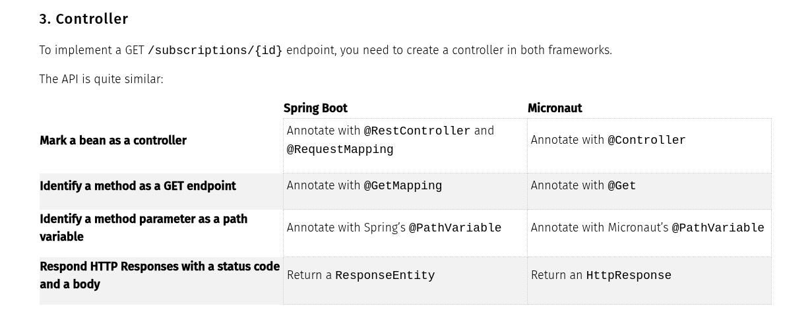
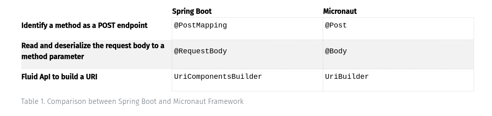
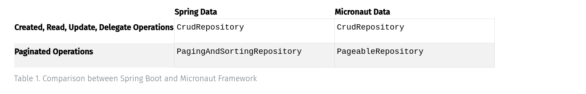

# Guias de usuarios Spring boot para Micronaut

## Classe de aplicação

Os aplicativos Spring Boot e Micronaut contêm uma classe de aplicativo simples que inicia o aplicativo para você.

### Classe de aplicação Spring Boot

```java
package example.micronaut;

import org.springframework.boot.SpringApplication;
import org.springframework.boot.autoconfigure.SpringBootApplication;

@SpringBootApplication
public class Application {
    public static void main(String[] args) {
        SpringApplication.run(Application.class, args);
    }
}
```

### Classe de aplicação Micronaut

```java
package example.micronaut;

import io.micronaut.runtime.Micronaut;

public class Application {

    public static void main(String[] args) {
        Micronaut.run(Application.class, args);
    }
}
```

Como podemos ver, a classe de aplicativo Micronaut são basicamente identicas, com a diferença de que o Spring Boot usa a anotação `@SpringBootApplication` para habilitar o recurso de inicialização automática, enquanto o Micronaut não precisa de nenhuma anotação especial, apenas chamando o método `Micronaut.run()` na classe principal.


## Definir manualmente um Bean

Tanto o Spring quanto o Micronaut são mecanismos de injeção de dependências. Neste tutorial, criaremos manualmente um bean, uma classe gerenciada pelo contexto do bean.


## Primeiro vamos comparar com a classe no spring boot

```java

package example.micronaut;

public interface Greeter {
    String greet();
}

package example.micronaut;

public class HelloGreeter implements Greeter {
    @Override
    public String greet() {
        return "Hello";
    }
}


package example.micronaut;

import org.springframework.context.annotation.Bean;
import org.springframework.context.annotation.Configuration;

@Configuration
class GreeterFactory {

    @Bean
    Greeter helloGreeter() {
        return new HelloGreeter();
    }
}


package example.micronaut;

import org.junit.jupiter.api.Test;
import org.springframework.beans.factory.annotation.Autowired;
import org.springframework.boot.test.context.SpringBootTest;

import static org.junit.jupiter.api.Assertions.*;

@SpringBootTest //1
class GreeterTest {

    @Autowired //2
    Greeter greeter;

    @Test
    void helloGreeterIsInjectedAsBeanOfTypeGreeter() {
        assertNotNull(greeter);
        assertEquals("Hello", greeter.greet());
    }

}

```

1 - A anotação `@SpringBootTest` é usada para definir a classe de teste como um teste de unidade do Spring Boot.
2 - A anotação `@Autowired` é usada para injetar o bean `Greeter` no teste.


## Agora vamos comparar com a classe no micronaut

Usamos a factory do micronaut para criar o bean

```java

package example.micronaut;

import io.micronaut.context.annotation.Factory;
import io.micronaut.context.annotation.Bean;

@Factory
class GreeterFactory {
    @Bean
    Greeter helloGreeter() {
        return new HelloGreeter();
    }
}

package example.micronaut;

import io.micronaut.test.extensions.junit5.annotation.MicronautTest;
import jakarta.inject.Inject;
import org.junit.jupiter.api.Test;
import static org.junit.jupiter.api.Assertions.*;

@MicronautTest
class GreeterTest {

    @Inject
    Greeter greeter;

    @Test
    void helloGreeterIsInjectedAsBeanOfTypeGreeter() {
        assertNotNull(greeter);
        assertEquals("Hello", greeter.greet());
    }

}

```

1 - A anotação `@MicronautTest` é usada para definir a classe de teste como um teste de unidade do Micronaut.
2 - A anotação `@Inject` é usada para injetar o bean `Greeter` no teste.

### Conclusão

Como podemos ver, o Micronaut e o Spring Boot são muito semelhantes, em nivel de código são quase idênticos, para trabalhar com bens no micronaut, usamos a anotação `@Factory` para definir a factory do bean, enquanto no Spring Boot usamos a anotação `@Configuration` para definir a factory.


## Marcar uma classe como um bean.- Spring Boot

Este guia compara como marcar uma classe como um bean em um aplicativo Spring Boot com @Component e em um aplicativo Micronaut com @Singleton.

Tanto o Spring quanto o Micronaut são mecanismos de injeção de dependências. Neste tutorial, criamos um bean "marcando" uma classe como bean.


### Primeiro vamos comparar com a classe no spring boot

```java

package example.micronaut;

public interface Greeter {
    String greet();
}

package example.micronaut;
import org.springframework.stereotype.Component;

@Component
public class HelloGreeter implements Greeter {
    @Override
    public String greet() {
        return "Hello";
    }
}

package example.micronaut;

import org.junit.jupiter.api.Test;
import org.springframework.beans.factory.annotation.Autowired;
import org.springframework.boot.test.context.SpringBootTest;

import static org.junit.jupiter.api.Assertions.*;

@SpringBootTest //1
class GreeterTest {

	@Autowired //2
	Greeter greeter;

	@Test
	void helloGreeterIsInjectedAsBeanOfTypeGreeter() {
		assertNotNull(greeter);
		assertEquals("Hello", greeter.greet());
	}

}

```

1 - A @SpringBootTestanotação informa ao Spring Boot para procurar uma classe de configuração principal (uma com @SpringBootApplication, por exemplo) e usá-la para iniciar um contexto de aplicativo Spring.
2 - Injete um bean do tipo Greeterusando @Autowireda definição de campo.


### Agora vamos comparar com a classe no micronaut

No framework Micronaut, podemos criar uma implementação e anotá-la com @Singleton.

```java


package example.micronaut;

import jakarta.inject.Singleton;

@Singleton
public class HelloGreeter implements Greeter {
    @Override
    public String greet() {
        return "Hello";
    }
}

package example.micronaut;

import io.micronaut.test.extensions.junit5.annotation.MicronautTest;
import jakarta.inject.Inject;
import org.junit.jupiter.api.Test;
import static org.junit.jupiter.api.Assertions.*;

@MicronautTest //1
class GreeterTest {

    @Inject //2
    Greeter greeter;

    @Test
    void helloGreeterIsInjectedAsBeanOfTypeGreeter() {
        assertNotNull(greeter);
        assertEquals("Hello", greeter.greet());
    }

}

```

1 - A anotação @MicronautTest informa ao Micronaut para procurar uma classe de configuração principal (uma com @MicronautApplication, por exemplo) e usá-la para iniciar um contexto de aplicativo Micronaut.
2 - Injete um bean do tipo Greeterusando @Injecta definição de campo.


### Conclusão

Como podemos ver, o Micronaut e o Spring Boot são muito semelhantes, em nivel de código são quase idênticos, para trabalhar com bens no micronaut, usamos a anotação @Singleton para definir o bean, enquanto no Spring Boot usamos a anotação @Component para definir o bean.


## Construindo URIs

Este guia compara o uso do UriComponentsBuilder do Spring com o UriBuilder do Micronaut Framework.

Ao desenvolver aplicações web, frequentemente precisamos construir URIs. Por exemplo, para criar respostas de redirecionamento. Neste artigo, comparamos duas APIs semelhantes: Spring UriComponentsBuildere Micronaut UriBuilder .

### Primeiro vamos comparar com a classe no spring boot

```java

package example.micronaut;

import org.junit.jupiter.api.Test;
import org.springframework.web.util.UriComponentsBuilder;

import static org.junit.jupiter.api.Assertions.assertEquals;

public class UriComponentsBuilderTest {

    @Test
    void youCanUseUriComponentsBuilderToBuildUris() {
        String isbn = "1680502395";
        assertEquals("/book/1680502395?lang=es", UriComponentsBuilder.fromUriString("/book")
                .path("/" + isbn)
                .queryParam("lang", "es")
                .build()
                .toUriString());
    }
}

```

### Agora vamos comparar com a classe no micronaut

Como você pode ver no trecho de código a seguir, a API é semelhante. Você deve conseguir migrar facilmente.

```java
package example.micronaut;

import io.micronaut.http.uri.UriBuilder;
import org.junit.jupiter.api.Test;

import static org.junit.jupiter.api.Assertions.assertEquals;

public class UriBuilderTest {

    @Test
    void youCanUseUriBuilderToBuildUris() {
        String isbn = "1680502395";
        assertEquals("/book/1680502395?lang=es", UriBuilder.of("/book")
                .path(isbn)
                .queryParam("lang", "es")
                .build()
                .toString());
    }
}


```

## Execute um aplicativo Spring Boot como um aplicativo Micronaut

[link](https://guides.micronaut.io/latest/micronaut-spring-boot-maven-java.html)

Este guia compara como executar um aplicativo Spring Boot como um aplicativo Micronaut.


## Micronaut Data para spring boot

[link](https://guides.micronaut.io/latest/spring-boot-micronaut-data-gradle-java.html)

## Testando serialização spring boot vs micronaut - criando rest api

Este guia compara como testar serialização em um Micronaut Framework e aplicativos Spring Boot.

Este guia é o primeiro tutorial de Construindo uma API REST - uma série de tutoriais que comparam como desenvolver uma API REST com o Micronaut Framework e o Spring Boot.


### Registro


A aplicação que construiremos é uma API REST para assinaturas de Software como Serviço (SaaS). A aplicação serializa e desserializa o seguinte registro Java de/para JSON.

```java
package example.micronaut;

record SaasSubscription(Long id, String name, Integer cents) {
}

 ```

 O Micronaut suporta serialização com o Jackson Databind ou com a serialização do Micronaut . Se você usar o Micronaut Jackson Databind, o registro acima será idêntico no Micronaut Framework e no Spring Boot.

 #### Serialização do Micronaut

Se você usar a serialização Micronaut, deverá optar pela classe a ser submetida à serialização, o que pode ser feito facilmente anotando-a com
`@Serdeable`

```java

package example.micronaut;

import io.micronaut.serde.annotation.Serdeable;

@Serdeable
record SaasSubscription(Long id, String name, Integer cents) {
}

```

#### Json esperado

```json
{
  "id": 1,
  "name": "Micronaut",
  "cents": 1000
}
```

#### Teste

Neste tutorial, usamos AssertJ nos testes. Além disso, usamos Jayway JsonPath - uma DSL Java para leitura de documentos JSON

#### Teste de unidade do Spring Boot

Como a criação de um contexto de aplicação no Spring Boot é lenta , os testes de integração no Spring Boot utilizam o fatiamento de teste. Ao usar o fatiamento de teste, o Spring cria um contexto de aplicação reduzido para uma fatia específica.

```java

package example.micronaut;

import org.junit.jupiter.api.Test;
import org.springframework.beans.factory.annotation.Autowired;
import org.springframework.boot.test.autoconfigure.json.JsonTest;
import org.springframework.boot.test.json.JacksonTester;

import java.io.IOException;

import static org.assertj.core.api.Assertions.assertThat;

@JsonTest //1
class SaasSubscriptionJsonTest {

    @Autowired//2
    private JacksonTester<SaasSubscription> json; //3

    @Test
    void saasSubscriptionSerializationTest() throws IOException {
        SaasSubscription subscription = new SaasSubscription(99L, "Professional", 4900);
        assertThat(json.write(subscription)).isStrictlyEqualToJson("expected.json");
        assertThat(json.write(subscription)).hasJsonPathNumberValue("@.id");
        assertThat(json.write(subscription)).extractingJsonPathNumberValue("@.id")
                .isEqualTo(99);
        assertThat(json.write(subscription)).hasJsonPathStringValue("@.name");
        assertThat(json.write(subscription)).extractingJsonPathStringValue("@.name")
                .isEqualTo("Professional");
        assertThat(json.write(subscription)).hasJsonPathNumberValue("@.cents");
        assertThat(json.write(subscription)).extractingJsonPathNumberValue("@.cents")
                .isEqualTo(4900);
    }

    @Test
    void saasSubscriptionDeserializationTest() throws IOException {
        String expected = """
           {
               "id":100,
               "name": "Advanced",
               "cents":2900
           }
           """;
        assertThat(json.parse(expected))
                .isEqualTo(new SaasSubscription(100L, "Advanced", 2900));
        assertThat(json.parseObject(expected).id()).isEqualTo(100);
        assertThat(json.parseObject(expected).name()).isEqualTo("Advanced");
        assertThat(json.parseObject(expected).cents()).isEqualTo(2900);
    }
}

```

1 - Para testar se a serialização e desserialização do Object JSON estão funcionando conforme o esperado, você pode usar a `@JsonTest` anotação . `@JsonTest` que configura automaticamente o Jackson ObjectMapper, quaisquer `@JsonComponent` beans e quaisquer módulos Jackson.
2 - O `@Autowired` é usado para injetar o JacksonTester no teste.
3 - O `JacksonTester` é um recurso do Spring Boot que fornece uma maneira fácil de testar a serialização e desserialização de objetos JSON. Ele fornece métodos para escrever e ler objetos JSON, além de verificar se o JSON gerado corresponde ao esperado.

#### Teste de unidade do Micronaut

```java
package example.micronaut;

import com.jayway.jsonpath.DocumentContext;
import com.jayway.jsonpath.JsonPath;
import io.micronaut.core.io.ResourceLoader;
import io.micronaut.json.JsonMapper;
import io.micronaut.test.extensions.junit5.annotation.MicronautTest;
import org.junit.jupiter.api.Test;

import java.io.BufferedReader;
import java.io.IOException;
import java.io.InputStream;
import java.io.InputStreamReader;
import java.io.Reader;
import java.nio.charset.StandardCharsets;
import java.util.Optional;
import java.util.stream.Collectors;

import static org.assertj.core.api.Assertions.assertThat;

@MicronautTest(startApplication = false) //1
class SaasSubscriptionJsonTest {

    @Test
    void saasSubscriptionSerializationTest(JsonMapper json, ResourceLoader resourceLoader) throws IOException { //2
        SaasSubscription subscription = new SaasSubscription(99L, "Professional", 4900);
        String expected = getResourceAsString(resourceLoader, "expected.json");
        String result = json.writeValueAsString(subscription);
        assertThat(result).isEqualToIgnoringWhitespace(expected);
        DocumentContext documentContext = JsonPath.parse(result);
        Number id = documentContext.read("$.id");
        assertThat(id)
                .isNotNull()
                .isEqualTo(99);

        String name = documentContext.read("$.name");
        assertThat(name)
                .isNotNull()
                .isEqualTo("Professional");

        Number cents = documentContext.read("$.cents");
        assertThat(cents)
                .isNotNull()
                .isEqualTo(4900);
    }

    @Test
    void saasSubscriptionDeserializationTest(JsonMapper json) throws IOException {
        String expected = """
           {
               "id":100,
               "name": "Advanced",
               "cents":2900
           }
           """;
        assertThat(json.readValue(expected, SaasSubscription.class))
                .isEqualTo(new SaasSubscription(100L, "Advanced", 2900));
        assertThat(json.readValue(expected, SaasSubscription.class).id()).isEqualTo(100);
        assertThat(json.readValue(expected, SaasSubscription.class).name()).isEqualTo("Advanced");
        assertThat(json.readValue(expected, SaasSubscription.class).cents()).isEqualTo(2900);
    }

    private static String getResourceAsString(ResourceLoader resourceLoader, String resourceName) {
        return resourceLoader.getResourceAsStream(resourceName)
                .flatMap(stream -> {
                    try (InputStream is = stream;
                         Reader reader = new InputStreamReader(is, StandardCharsets.UTF_8);
                         BufferedReader bufferedReader = new BufferedReader(reader)) {
                        return Optional.of(bufferedReader.lines().collect(Collectors.joining("\n")));
                    } catch (IOException e) {
                        e.printStackTrace();
                    }
                    return Optional.empty();
                })
                .orElse("");
    }
}

```

1 - Anote a classe com `@MicronautTest` para que o framework Micronaut inicialize o contexto da aplicação e o servidor embarcado. Por padrão, cada @Testmétodo será encapsulado em uma transação que será revertida quando o teste for concluído. Esse comportamento pode ser alterado configurando transaction-o como false.

2 - Por padrão, com o `JUnit 5`, os parâmetros do método de teste serão resolvidos para beans, se possível.

#### Conclusão

Como mostrado neste tutorial, testar serialização no Micronaut Framework e no Spring Boot é semelhante. A principal diferença é que o slicing de teste não é necessário no Micronaut Framework.


## Implementando GET  spring boot vs micronaut


Este guia compara como testar a implementação de um GET em um Micronaut Framework e em aplicativos Spring Boot.

Este guia é o segundo tutorial de Construindo uma API REST - uma série de tutoriais que comparam como desenvolver uma API REST com o Micronaut Framework e o Spring Boot.



> Outra diferença importante é a visibilidade dos métodos do controlador. **O Micronaut Framework não utiliza reflexão (o que resulta em melhor desempenho e melhor integração com tecnologias como GraalVM)** . Portanto, ele exige que os métodos do controlador sejam públicos, protegidos ou privados (sem modificadores). Ao longo destes tutoriais, os métodos dos controladores Micronaut utilizam privados.

### Controlador no Spring Boot

```java

package example.micronaut;

import org.springframework.http.ResponseEntity;
import org.springframework.web.bind.annotation.GetMapping;
import org.springframework.web.bind.annotation.PathVariable;
import org.springframework.web.bind.annotation.RequestMapping;
import org.springframework.web.bind.annotation.RestController;

@RestController //1
@RequestMapping("/subscriptions") //2
class SaasSubscriptionController {

    @GetMapping("/{id}") //3
    private ResponseEntity<SaasSubscription> findById(@PathVariable Long id) { //4
        if (id.equals(99L)) {
            SaasSubscription subscription = new SaasSubscription(99L, "Advanced", 2900);
            return ResponseEntity.ok(subscription);
        }
        return ResponseEntity.notFound().build(); //5
    }
}

```

1 - A anotação `@RestController` é usada para definir a classe como um controlador REST, o que significa que ela pode manipular requisições HTTP e retornar respostas HTTP.
2 - A anotação `@RequestMapping` é usada para definir o caminho base da requisição, que neste caso é `/subscriptions`.
3 - A anotação `@GetMapping` é usada para definir o método como um endpoint HTTP do tipo GET, ou seja, ele será chamado quando uma requisição GET for feita para o caminho `/subscriptions/{id}`.
4 - O método `findById` recebe o id como parâmetro e retorna um objeto `ResponseEntity<SaasSubscription>`, que é a resposta HTTP.
5 - Se o id for igual a 99, o método retorna um objeto `ResponseEntity` com o status HTTP 200 (OK) e o objeto `SaasSubscription` como corpo da resposta. Caso contrário, ele retorna um objeto `ResponseEntity` com o status HTTP 404 (NOT FOUND).


### Controlador no Micronaut

```java
package example.micronaut;

import io.micronaut.http.HttpResponse;
import io.micronaut.http.annotation.Controller;
import io.micronaut.http.annotation.Get;
import io.micronaut.http.annotation.PathVariable;

@Controller("/subscriptions") //1
class SaasSubscriptionController {

    @Get("/{id}")//2
    HttpResponse<SaasSubscription> findById(@PathVariable Long id) { //3
        if (id.equals(99L)) {
            SaasSubscription subscription = new SaasSubscription(99L, "Advanced", 2900);
            return HttpResponse.ok(subscription);
        }
        return HttpResponse.notFound(); //4
    }
}

//versão simplificada com retorno nulo
@Controller("/subscriptions")
class SaasSubscriptionController {

    @Get("/{id}")
    SaasSubscription findById(@PathVariable Long id) {
        if (id.equals(99L)) {
            return new SaasSubscription(99L, "Advanced", 2900);
        }
        return null;
    }
}

```

1 - A anotação `@Controller` é usada para definir a classe como um controlador REST, o que significa que ela pode manipular requisições HTTP e retornar respostas HTTP.
2 - A anotação `@Get` é usada para definir o método como um endpoint HTTP do tipo GET, ou seja, ele será chamado quando uma requisição GET for feita para o caminho `/subscriptions/{id}`.
3 - O método `findById` recebe o id como parâmetro e retorna um objeto `HttpResponse<SaasSubscription>`, que é a resposta HTTP.
4 - Se o id for igual a 99, o método retorna um objeto `HttpResponse` com o status HTTP 200 (OK) e o objeto `SaasSubscription` como corpo da resposta. Caso contrário, ele retorna um objeto `HttpResponse` com o status HTTP 404 (NOT FOUND).

> O código de status HTTP padrão em um método do controlador Micronaut é 200. No entanto, quando o método de um controlador Micronaut retorna nulo, o aplicativo responde com um código de status 404.


### Testes

```java

package example.micronaut;

import com.jayway.jsonpath.DocumentContext;
import com.jayway.jsonpath.JsonPath;
import io.micronaut.http.HttpResponse;
import io.micronaut.http.HttpStatus;
import io.micronaut.http.client.BlockingHttpClient;
import io.micronaut.http.client.HttpClient;
import io.micronaut.http.client.annotation.Client;
import io.micronaut.http.client.exceptions.HttpClientResponseException;
import io.micronaut.test.extensions.junit5.annotation.MicronautTest;
import jakarta.inject.Inject;
import org.junit.jupiter.api.Test;
import static org.assertj.core.api.Assertions.assertThat;
import static org.assertj.core.api.AssertionsForClassTypes.catchThrowableOfType;

@MicronautTest //1
class SaasSubscriptionControllerGetTest {

    @Inject //2
    @Client("/") //3
    HttpClient httpClient;

    @Test
    void shouldReturnASaasSubscriptionWhenDataIsSaved() {
        BlockingHttpClient client = httpClient.toBlocking();
        HttpResponse<String> response = client.exchange("/subscriptions/99", String.class);
        assertThat(response.status().getCode()).isEqualTo(HttpStatus.OK.getCode());

        DocumentContext documentContext = JsonPath.parse(response.body());
        Number id = documentContext.read("$.id");
        assertThat(id).isNotNull();
        assertThat(id).isEqualTo(99);

        String name = documentContext.read("$.name");
        assertThat(name).isNotNull();
        assertThat(name).isEqualTo("Advanced");

        Integer cents = documentContext.read("$.cents");
        assertThat(cents).isEqualTo(2900);
    }

    @Test
    void shouldNotReturnASaasSubscriptionWithAnUnknownId() {
        BlockingHttpClient client = httpClient.toBlocking();
        HttpClientResponseException thrown = catchThrowableOfType(() -> //4
                client.exchange("/subscriptions/1000", String.class), HttpClientResponseException.class);
        assertThat(thrown.getStatus().getCode()).isEqualTo(HttpStatus.NOT_FOUND.getCode());
        assertThat(thrown.getResponse().getBody()).isEmpty();
    }
}

```

1 - Anote a classe com `@MicronautTest` para que o framework Micronaut inicialize o contexto da aplicação e o servidor embarcado. Mais informações .
2 - Injete o `HttpClient` bean e aponte-o para o servidor incorporado.
3 - Quando o cliente HTTP recebe uma resposta com um código de status HTTP >= 400, ele lança um `HttpClientResponseException`. Você pode obter o status e o corpo da resposta a partir da exceção.


### Conclusão

A definição de rotas é extremamente semelhante em ambos os frameworks. No entanto, o Micronaut Framework oferece validação de rotas em tempo de compilação e uma abordagem sem reflexão para isso.


## [Implementando POST  spring boot vs micronaut](https://guides.micronaut.io/latest/building-a-rest-api-spring-boot-vs-micronaut-post-gradle-java.html)

Este guia compara como escrever um endpoint POST apoiado por uma camada de persistência em um Micronaut Framework e aplicativos Spring Boot.

O aplicativo Spring Boot usa *Spring Data e H2* . O aplicativo Micronaut usa *Micronaut Data e H2*. O Micronaut Data é um kit de ferramentas de acesso a banco de dados que usa compilação Ahead of Time (AoT) para pré-computar consultas para interfaces de repositório, que são então executadas por uma camada de tempo de execução fina e leve.

Este guia é o quarto tutorial de Construindo uma API REST - uma série de tutoriais que comparam como desenvolver uma API REST com o Micronaut Framework e o Spring Boot.

### Controlador

O controlador recebe uma solicitação POST com um corpo JSON, o repositório persiste o SaasSubscriptione então retorna uma resposta 201 com um Location cabeçalho HTTP.




### Controlador Micronaut

```java

package example.micronaut;

import io.micronaut.http.HttpResponse;
import io.micronaut.http.annotation.Body;
import io.micronaut.http.annotation.Controller;
import io.micronaut.http.annotation.Post;
import io.micronaut.http.uri.UriBuilder;

import java.net.URI;

@Controller("/subscriptions")//1
class SaasSubscriptionPostController {

    private final SaasSubscriptionRepository repository;

    SaasSubscriptionPostController(SaasSubscriptionRepository repository) {//2
        this.repository = repository;
    }

    @Post//3
    HttpResponse<?> createSaasSubscription(@Body SaasSubscription newSaasSubscription) {//4
        SaasSubscription savedSaasSubscription = repository.save(newSaasSubscription);
        URI locationOfNewSaasSubscription = UriBuilder.of("/subscriptions") //5
                .path(savedSaasSubscription.id().toString())
                .build();
        return HttpResponse.created(locationOfNewSaasSubscription);
    }
}

```

1 - A classe é definida como um controlador com a anotação `@Controller` mapeada para o caminho /subscriptions.
2 - Use injeção de construtor para injetar um bean do tipo `SaasSubscriptionRepository`.
3 - A anotação `@Post` mapeia o `createSaasSubscription` método para uma solicitação HTTP POST em /subscriptions.
4 - A `@Bodyanotação` indica que o corpo da solicitação deve ser analisado pelo Micronaut Framework e vinculado ao parâmetro anotado.
5 - A API do `UriBuilder` permite que você crie um java.net.URIfacilmente.


### Testes

```java

package example.micronaut;

import com.jayway.jsonpath.DocumentContext;
import com.jayway.jsonpath.JsonPath;
import io.micronaut.http.HttpHeaders;
import io.micronaut.http.HttpRequest;
import io.micronaut.http.HttpResponse;
import io.micronaut.http.HttpStatus;
import io.micronaut.http.client.BlockingHttpClient;
import io.micronaut.http.client.HttpClient;
import io.micronaut.http.client.annotation.Client;
import io.micronaut.test.extensions.junit5.annotation.MicronautTest;
import org.junit.jupiter.api.Test;

import java.net.URI;
import java.util.Optional;

import static org.assertj.core.api.Assertions.assertThat;

@MicronautTest//1
class SaasSubscriptionPostControllerTest {

    @Test
    void shouldCreateANewSaasSubscription(@Client("/") HttpClient httpClient) { //2
        BlockingHttpClient client = httpClient.toBlocking();
        SaasSubscription subscription = new SaasSubscription(100L, "Advanced", 2900);

        HttpResponse<Void> createResponse = client.exchange(HttpRequest.POST("/subscriptions", subscription), Void.class);
        assertThat(createResponse.getStatus().getCode()).isEqualTo(HttpStatus.CREATED.getCode());
        Optional<URI> locationOfNewSaasSubscriptionOptional = createResponse.getHeaders().get(HttpHeaders.LOCATION, URI.class);
        assertThat(locationOfNewSaasSubscriptionOptional).isPresent();

        URI locationOfNewSaasSubscription = locationOfNewSaasSubscriptionOptional.get();
        HttpResponse<String> getResponse = client.exchange(HttpRequest.GET(locationOfNewSaasSubscription), String.class);
        assertThat(getResponse.getStatus().getCode()).isEqualTo(HttpStatus.OK.getCode());

        DocumentContext documentContext = JsonPath.parse(getResponse.body());
        Number id = documentContext.read("$.id");
        assertThat(id).isNotNull();

        Integer cents = documentContext.read("$.cents");
        assertThat(cents).isEqualTo(2900);
    }
}

```

1 - Anote a classe com `@MicronautTest` para que o framework Micronaut inicialize o contexto da aplicação e o servidor embarcado. Mais informações .
2 - Injete o `HttpClient` bean e aponte-o para o servidor incorporado. O cliente HTTP é injetado como um parâmetro de método, o que significa que ele será fechado automaticamente após o teste ser concluído.


### Conclusão

Como você pode ver neste guia, o código para escrever um endpoint POST apoiado por uma camada de persistência em aplicações Micronaut Framework e Spring Boot é muito semelhante. No entanto, a abordagem de tempo de compilação do Micronaut não requer reflexão ou proxies, resultando em aplicações mais rápidas e eficientes.


## Data - Spring Boot vs Micronaut

Este guia compara como alimentar um ponto de extremidade GET com uma camada de persistência em um Micronaut Framework e aplicativos Spring Boot.

O aplicativo Spring Boot usa Spring Data e H2 . O aplicativo Micronaut usa Micronaut Data e H2.

Este guia é o terceiro tutorial de Construindo uma API REST - uma série de tutoriais que comparam como desenvolver uma API REST com o Micronaut Framework e o Spring Boot.

O Micronaut Data é um kit de ferramentas de acesso a banco de dados que usa compilação Ahead of Time (AoT) para pré-computar consultas para interfaces de repositório que são então executadas por uma camada de tempo de execução fina e leve.


### Dados do Micronaut vs. Dados do Spring


O Micronaut Data melhora o Spring Data nas seguintes maneiras:

* *No runtime model* - O Spring Data mantém um metamodelo de tempo de execução que usa reflexão para modelar relacionamentos entre entidades. Este modelo consome bastante memória e os requisitos de memória aumentam conforme o tamanho da sua aplicação cresce. O problema é ainda pior quando combinado com o Hibernate, que mantém seu próprio metamodelo, pois você acaba com metamodelos duplicados.
*  *No query translation* - O Spring Data utiliza expressões regulares e correspondência de padrões em combinação com proxies gerados em tempo de execução para traduzir uma definição de método em uma interface Java para uma consulta em tempo de execução. Não existe tal tradução em tempo de execução no Micronaut Data, e esse trabalho é realizado pelo compilador Micronaut em tempo de compilação.
*  *Sem proxies de reflexão ou tempo de execução* - O Micronaut Data não usa proxies de reflexão ou tempo de execução, resultando em melhor desempenho, rastreamentos de pilha menores e consumo de memória reduzido devido à completa ausência de caches de reflexão (observe que a implementação de suporte, por exemplo, o Hibernate, pode usar reflexão).
*  *Type Safety * -  O Micronaut Data verificará ativamente no momento da compilação se um método de repositório pode ser implementado e falhará na compilação se isso não puder ser feito.
*


### Dependências

```gradle
annotationProcessor("io.micronaut.data:micronaut-data-processor")
implementation("io.micronaut.data:micronaut-data-jdbc")
runtimeOnly("com.h2database:h2")
```

Observe a adição de " micronaut-data-processorno classpath do processador de anotações. O Micronaut Data realiza bastante trabalho de compilação, o que resulta em aplicativos com melhor desempenho e menor consumo de memória.


### Entidades

```java
package example.micronaut;

import io.micronaut.serde.annotation.Serdeable;
import io.micronaut.data.annotation.Id;
import io.micronaut.data.annotation.MappedEntity;

@Serdeable//1
@MappedEntity //2
record SaasSubscription(@Id Long id,//3
                        String name,
                        Integer cents) {
}

```

1 - A anotação `@Serdeable` é usada para indicar que a classe pode ser serializada e desserializada pelo Micronaut.
2 - A anotação `@MappedEntity` é usada para indicar que a classe é uma entidade mapeada para uma tabela no banco de dados.
3 - A anotação `@Id` é usada para indicar que o campo id é a chave primária da entidade.


### SQl

O Spring Boot carrega SQL a partir dos locais padrão do classpath raiz: schema.sqledata.sql . O Micronaut Framework recomenda que você gerencie o esquema do seu banco de dados com Liquibase ou Flyway . No entanto, para manter os aplicativos o mais próximos possível, criaremos o esquema do banco de dados com um arquivo SQL no aplicativo Micronaut. O Micronaut Test suporta o carregamento de SQL antes dos testes sem problemas. Para manter ambos os aplicativos o mais próximos possível.

```sql

CREATE TABLE IF NOT EXISTS saas_subscription
(
    id     BIGINT GENERATED BY DEFAULT AS IDENTITY PRIMARY KEY,
    name  VARCHAR(255) NOT NULL,
    cents NUMBER NOT NULL DEFAULT 0
);

INSERT INTO saas_subscription(id, name, cents) VALUES (99, 'Advanced', 2900);

```

#### Repositório

Tanto o Micronaut Data quanto o Spring Data permitem que os desenvolvedores utilizem o padrão de repositório. Você escreve uma interface e o framework fornece a implementação.

```java
package example.micronaut;

import io.micronaut.data.jdbc.annotation.JdbcRepository;
import io.micronaut.data.model.query.builder.sql.Dialect;
import io.micronaut.data.repository.CrudRepository;

@JdbcRepository(dialect = Dialect.H2)//1
interface SaasSubscriptionRepository extends CrudRepository<SaasSubscription, Long> {//2
}

```

1 - A anotação `@JdbcRepository` é usada para indicar que a interface é um repositório JDBC e o banco de dados é H2.
2 - A interface `SaasSubscriptionRepository` estende a interface `CrudRepository`, que fornece métodos para operações CRUD (Create, Read, Update, Delete) na entidade `SaasSubscription`.

### Controlador


```java

package example.micronaut;

import io.micronaut.http.HttpResponse;
import io.micronaut.http.annotation.Controller;
import io.micronaut.http.annotation.Get;
import io.micronaut.http.annotation.PathVariable;

@Controller("/subscriptions")//1
class SaasSubscriptionController {

    private final SaasSubscriptionRepository repository;

    SaasSubscriptionController(SaasSubscriptionRepository repository) {//2
        this.repository = repository;
    }

    @Get("/{id}") //3
    HttpResponse<SaasSubscription> findById(@PathVariable Long id) {//4
        return repository.findById(id)
                .map(HttpResponse::ok)
                .orElseGet(HttpResponse::notFound);
    }
}

```

1 - A classe é definida como um controlador com a anotação `@Controller` mapeada para o caminho /subscriptions.
2 - Use injeção de construtor para injetar um bean do tipo `SaasSubscriptionRepository`.
3 - A anotação `@Get` mapeia o `findById` método para uma solicitação HTTP GET em /subscriptions.
4 - O método `findById` recebe o id como parâmetro e retorna um objeto `HttpResponse<SaasSubscription>`, que é a resposta HTTP. Se o id for encontrado, o método retorna um objeto `HttpResponse` com o status HTTP 200 (OK) e o objeto `SaasSubscription` como corpo da resposta. Caso contrário, ele retorna um objeto `HttpResponse` com o status HTTP 404 (NOT FOUND).

### Testes

```java

package example.micronaut;

import com.jayway.jsonpath.DocumentContext;
import com.jayway.jsonpath.JsonPath;
import io.micronaut.http.HttpResponse;
import io.micronaut.http.HttpStatus;
import io.micronaut.http.client.BlockingHttpClient;
import io.micronaut.http.client.HttpClient;
import io.micronaut.http.client.annotation.Client;
import io.micronaut.http.client.exceptions.HttpClientResponseException;
import io.micronaut.test.extensions.junit5.annotation.MicronautTest;
import jakarta.inject.Inject;
import org.junit.jupiter.api.Test;
import static org.assertj.core.api.Assertions.assertThat;
import static org.assertj.core.api.AssertionsForClassTypes.catchThrowableOfType;
import io.micronaut.test.annotation.Sql;

@Sql(value = {"classpath:schema.sql", "classpath:data.sql"}) //1
@MicronautTest //2
class SaasSubscriptionControllerGetTest {

    @Inject
    @Client("/")//3
    HttpClient httpClient;

    @Test
    void shouldReturnASaasSubscriptionWhenDataIsSaved() {
        BlockingHttpClient client = httpClient.toBlocking();
        HttpResponse<String> response = client.exchange("/subscriptions/99", String.class);
        assertThat(response.status().getCode()).isEqualTo(HttpStatus.OK.getCode());

        DocumentContext documentContext = JsonPath.parse(response.body());
        Number id = documentContext.read("$.id");
        assertThat(id).isNotNull();
        assertThat(id).isEqualTo(99);

        String name = documentContext.read("$.name");
        assertThat(name).isNotNull();
        assertThat(name).isEqualTo("Advanced");

        Integer cents = documentContext.read("$.cents");
        assertThat(cents).isEqualTo(2900);
    }

    @Test
    void shouldNotReturnASaasSubscriptionWithAnUnknownId() {
        BlockingHttpClient client = httpClient.toBlocking();
        HttpClientResponseException thrown = catchThrowableOfType(() -> //4
                client.exchange("/subscriptions/1000", String.class), HttpClientResponseException.class);
        assertThat(thrown.getStatus().getCode()).isEqualTo(HttpStatus.NOT_FOUND.getCode());
        assertThat(thrown.getResponse().getBody()).isEmpty();
    }
}

```

1 - A anotação `@Sql` é usada para carregar o esquema e os dados do banco de dados a partir de arquivos SQL no classpath. O Micronaut Test executa esses arquivos SQL antes de executar os testes.
2 - Anote a classe com `@MicronautTest` para que o framework Micronaut inicialize o contexto da aplicação e o servidor embarcado. Mais informações .
3 - Injete o `HttpClient` bean e aponte-o para o servidor incorporado.
4 - Quando o cliente HTTP recebe uma resposta com um código de status HTTP >= 400, ele lança um `HttpClientResponseException`. Você pode obter o status e o corpo da resposta a partir da exceção.


### Conclusão

Adicionar uma camada de persistência é fácil em ambas as estruturas, e a API é quase idêntica. No entanto, a abordagem sem reflexão e em tempo de compilação da Micronaut Data resulta em melhor desempenho, rastreamentos de pilha menores e consumo de memória reduzido.

## paginação e listagem - Spring Boot vs Micronaut

Este guia compara como escrever um endpoint POST apoiado por uma camada de persistência em um Micronaut Framework e aplicativos Spring Boot.

O aplicativo Spring Boot usa Spring Data e H2 . O aplicativo Micronaut usa Micronaut Data e H2. O Micronaut Data é um kit de ferramentas de acesso a banco de dados que usa compilação Ahead of Time (AoT) para pré-computar consultas para interfaces de repositório, que são então executadas por uma camada de tempo de execução fina e leve.

Este guia é o quarto tutorial de Construindo uma API REST - uma série de tutoriais que comparam como desenvolver uma API REST com o Micronaut Framework e o Spring Boot.


### Paginação

Ao retornar vários registros, você precisa de algum controle sobre a paginação dos dados. O Micronaut Data inclui a capacidade de especificar requisitos de paginação com o tipo Pageable . Os mesmos conceitos existem no Spring Data com org.springframework.data.domain.Pageable .


### Repositório


O Micronaut Data e o Spring Data aprimoram o padrão de repositório ao fornecer interfaces paginadas a partir das quais você pode estender.

O pacote Spring Data é org.springframework.data.repositorye o pacote Micronaut Data é io.micronaut.data.repository.



```java

package example.micronaut;

import io.micronaut.data.jdbc.annotation.JdbcRepository;
import io.micronaut.data.model.query.builder.sql.Dialect;
import io.micronaut.data.repository.PageableRepository;

@JdbcRepository(dialect = Dialect.H2)//1
interface SaasSubscriptionRepository extends PageableRepository<SaasSubscription, Long> {//2
}

 ```

1 - A anotação `@JdbcRepository` é usada para indicar que a interface é um repositório JDBC e o banco de dados é H2.
2 - PageableRepository extends CrudRepository, which provides automatic generation of CRUD (Create, Read, Update, Delete) operations and adds methods for pagination.


### Controlador

```java
package example.micronaut;

import io.micronaut.data.model.Page;
import io.micronaut.data.model.Pageable;
import io.micronaut.data.model.Sort;
import io.micronaut.http.annotation.Controller;
import io.micronaut.http.annotation.Get;

@Controller("/subscriptions") //1
class SaasSubscriptionGetListController {

    private static final Sort CENTS = Sort.of(Sort.Order.asc("cents"));
    private final SaasSubscriptionRepository repository;

    SaasSubscriptionGetListController(SaasSubscriptionRepository repository) { //2
        this.repository = repository;
    }

    @Get //3
    Iterable<SaasSubscription> findAll(Pageable pageable) { //4
        Page<SaasSubscription> page = repository.findAll(pageable.getSort().isSorted()
                ? pageable
                : Pageable.from(pageable.getNumber(), pageable.getSize(), CENTS)
        );//5
        return page.getContent();
    }
}

 ```

1 - A classe é definida como um controlador com a anotação `@Controller` mapeada para o caminho /subscriptions.
2 - Use injeção de construtor para injetar um bean do tipo `SaasSubscriptionRepository`.
3 - A anotação `@Get` mapeia o `findAll` método para uma solicitação HTTP GET em /subscriptions.
4 - O método `findAll` recebe um objeto `Pageable` como parâmetro, que contém informações sobre a paginação e a ordenação dos resultados.
5 - O método `findAll` chama o repositório para obter uma página de resultados. Se a solicitação não contiver informações de ordenação, o método aplica uma ordenação padrão com base no campo cents.

### Testes

```java

package example.micronaut;

import com.jayway.jsonpath.DocumentContext;
import com.jayway.jsonpath.JsonPath;
import io.micronaut.http.HttpRequest;
import io.micronaut.http.HttpResponse;
import io.micronaut.http.HttpStatus;
import io.micronaut.http.client.BlockingHttpClient;
import io.micronaut.http.client.HttpClient;
import io.micronaut.http.client.annotation.Client;
import io.micronaut.http.uri.UriBuilder;
import io.micronaut.test.annotation.Sql;
import io.micronaut.test.extensions.junit5.annotation.MicronautTest;
import jakarta.inject.Inject;
import net.minidev.json.JSONArray;
import org.junit.jupiter.api.Test;

import java.net.URI;

import static org.assertj.core.api.Assertions.assertThat;

@Sql(value = {"classpath:schema.sql", "classpath:data.sql"}) //1
@MicronautTest//2
class SaasSubscriptionGetListControllerTest {

    @Inject
    @Client("/") //3
    HttpClient httpClient;

    @Test
    void shouldReturnASortedPageOfSaasSubscriptions() {
        BlockingHttpClient client = httpClient.toBlocking();
        URI uri = UriBuilder.of("/subscriptions")
                .queryParam("page", 0)
                .queryParam("size", 1)
                .queryParam("sort", "cents,desc")
                .build();
        HttpResponse<String> response = client.exchange(HttpRequest.GET(uri), String.class);
        assertThat(response.status().getCode()).isEqualTo(HttpStatus.OK.getCode());

        DocumentContext documentContext = JsonPath.parse(response.body());
        JSONArray page = documentContext.read("$[*]");
        assertThat(page).hasSize(1);

        Integer cents = documentContext.read("$[0].cents");
        assertThat(cents).isEqualTo(4900);
    }

    @Test
    void shouldReturnAPageOfSaasSubscriptions() {
        BlockingHttpClient client = httpClient.toBlocking();
        URI uri = UriBuilder.of("/subscriptions")
                .queryParam("page", 0)
                .queryParam("size", 1)
                .build();
        HttpResponse<String> response = client.exchange(HttpRequest.GET(uri), String.class);
        assertThat(response.status().getCode()).isEqualTo(HttpStatus.OK.getCode());

        DocumentContext documentContext = JsonPath.parse(response.body());
        JSONArray page = documentContext.read("$[*]");
        assertThat(page.size()).isEqualTo(1);
    }

    @Test
    void shouldReturnAllSaasSubscriptionsWhenListIsRequested() {
        BlockingHttpClient client = httpClient.toBlocking();
        HttpResponse<String> response = client.exchange("/subscriptions", String.class);
        assertThat(response.status().getCode()).isEqualTo(HttpStatus.OK.getCode());

        DocumentContext documentContext = JsonPath.parse(response.body());
        int saasSubscriptionCount = documentContext.read("$.length()");
        assertThat(saasSubscriptionCount).isEqualTo(3);

        JSONArray ids = documentContext.read("$..id");
        assertThat(ids).containsExactlyInAnyOrder(99, 100, 101);

        JSONArray cents = documentContext.read("$..cents");
        assertThat(cents).containsExactlyInAnyOrder(1400, 2900, 4900);
    }
}

```

### Conclusão

Adicionar paginação à camada de persistência é fácil em ambas as estruturas, e a API é quase idêntica. No entanto, a abordagem sem reflexão e em tempo de compilação da Micronaut Data resulta em melhor desempenho, rastreamentos de pilha menores e consumo de memória reduzido.
